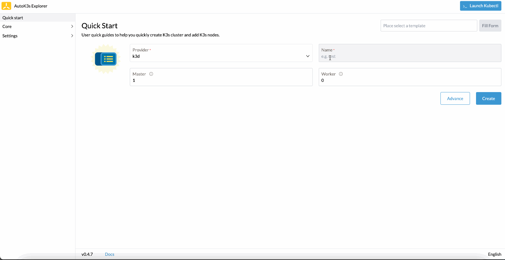

<div align="center">
  <h1>AutoK3s</h1>
  <p>
    <a href="https://drone-pandaria.cnrancher.com/cnrancher/pandaria"></a>
    <a href="https://goreportcard.com/report/github.com/cnrancher/autok3s"></a>
    <a href="https://github.com/cnrancher/autok3s/releases"></a>
    <a href="https://github.com/cnrancher/autok3s/releases"></a>
  </p>
  <span>English / </span> <a href="http://docs.rancher.cn/docs/k3s/autok3s/_index/">Simplified Chinese</a>
</div>

<hr />

## What is AutoK3s

[K3s](https://github.com/k3s-io/k3s) is a fully certified Kubernetes offering, it can replace the "full-fat" K8s in some cases.

AutoK3s is a lightweight tool for simplifying the cluster management of K3s, it can help you **Run K3s Everywhere**.

<!-- toc -->

- [Key Features](#key-features)
- [Providers](#providers)
- [Quick Start (tl;dr)](#quick-start-tldr)
- [Demo Video](#demo-video)
- [Developers' Guide](#developers-guide)
- [Source Code](#source-code)
- [License](#license)

<!-- /toc -->

## Key Features

- Shorter provisioning time with API, CLI and UI dashboard.
- Cloud provider Integration(simplifies the setup process of [CCM](https://kubernetes.io/docs/concepts/architecture/cloud-controller) on cloud providers).
- Flexible installation options, like K3s cluster HA and datastore(embedded etcd, RDS, SQLite, etc.).
- Low cost(try spot instances in each cloud).
- Simplify operations by UI dashboard.
- Portability between clouds by leveraging tools like [backup-restore-operator](https://github.com/rancher/backup-restore-operator).
- [Airgap](docs/i18n/en_us/airgap/README.md) K3s package management and installation.

## Providers

Now supports the following providers, we encourage submitting PR contribution for more providers:

- [aws](docs/i18n/en_us/aws/README.md) - Bootstrap K3s onto Amazon EC2
- [google](docs/i18n/en_us/google/README.md) - Bootstrap K3s onto Google Compute Engine
- [alibaba](docs/i18n/en_us/alibaba/README.md) - Bootstrap K3s onto Alibaba ECS
- [tencent](docs/i18n/en_us/tencent/README.md) - Bootstrap K3s onto Tencent CVM
- [k3d](docs/i18n/en_us/k3d/README.md) - Bootstrap K3d onto Local Machine
- [harvester](docs/i18n/en_us/harvester/README.md) - Bootstrap K3s onto Harvester VM
- [native](docs/i18n/en_us/native/README.md) - Bootstrap K3s onto any VM

## Quick Start (tl;dr)

Scenario 1 - Run with docker:

```bash
# The commands will start autok3s daemon with an interactionable UI.
# Standard Linux (Recommended)
$ docker run -itd --restart=unless-stopped --net=host -v /var/run/docker.sock:/var/run/docker.sock cnrancher/autok3s:v0.6.1

# MacOS
$ docker run -itd --restart=unless-stopped -p 8080:8080 -v /var/run/docker.sock:/var/run/docker.sock cnrancher/autok3s:v0.6.1
```

Scenario 2 - Run with docker-compose

```bash
# AutoK3s is available at: http://autok3s.vcap.me (vcap.me resolves to 127.0.0.1).
# The cli and container uses the same `AUTOK3S_CONFIG` directory.
docker-compose up -d
```

Scenario 3 - Run with cli:

```bash
# The commands use the shell script on MacOS and Linux, or visit the Releases page to download the executable for Windows.
curl -sS https://rancher-mirror.oss-cn-beijing.aliyuncs.com/autok3s/install.sh  | sh

# The commands will start autok3s daemon with an interactionable UI.
autok3s -d serve
```

## Uninstall

To uninstall autok3s cli, please execute command below:

```bash
/usr/local/bin/autok3s-uninstall.sh
```

## Demo Video

In the demo, we install K3s by k3d provider in around 1 minute, and
we can manage K3s clusters by kube-explorer dashboard.

Watch the demo:



## Developers' Guide

Use `dapper` to manage project compilation, testing and packaging.

- compilation: `make autok3s build`
- testing: `make autok3s unit`
- packing: `make autok3s package only`

Install `dapper` please follow the [dapper](https://github.com/rancher/dapper) project.

## Source Code

AutoK3s is 100% open-source software. The project source code is spread across a number of repos:

- https://github.com/cnrancher/autok3s
- https://github.com/cnrancher/autok3s-ui
- https://github.com/cnrancher/kube-explorer

# License

Copyright (c) 2022 [Rancher Labs, Inc.](http://rancher.com)

Licensed under the Apache License, Version 2.0 (the "License");
you may not use this file except in compliance with the License.
You may obtain a copy of the License at

[http://www.apache.org/licenses/LICENSE-2.0](http://www.apache.org/licenses/LICENSE-2.0)

Unless required by applicable law or agreed to in writing, software
distributed under the License is distributed on an "AS IS" BASIS,
WITHOUT WARRANTIES OR CONDITIONS OF ANY KIND, either express or implied.
See the License for the specific language governing permissions and
limitations under the License.
