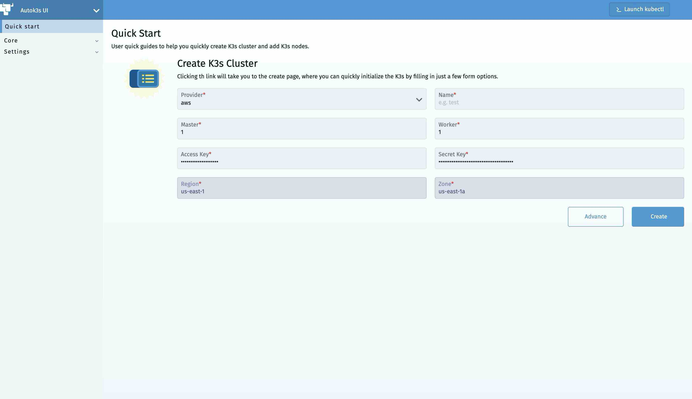
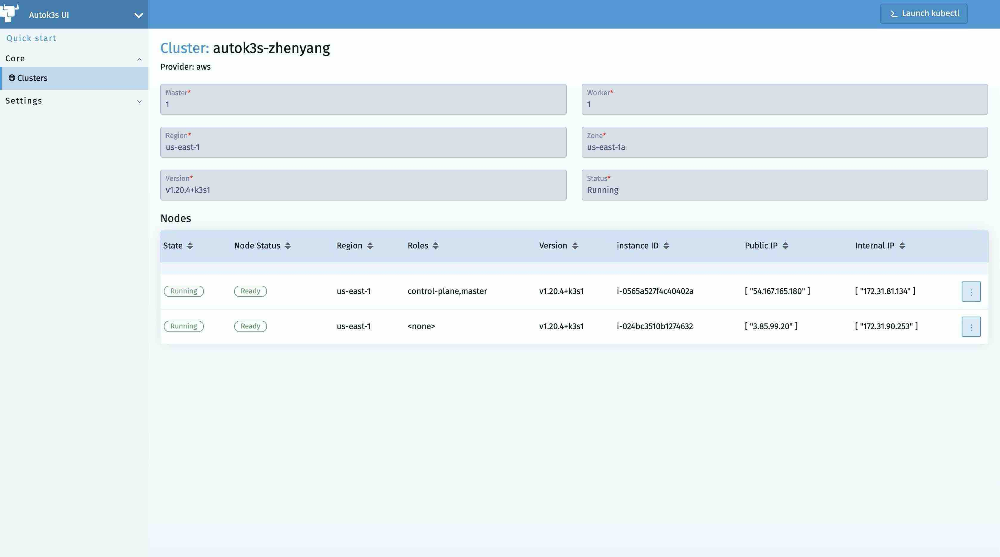
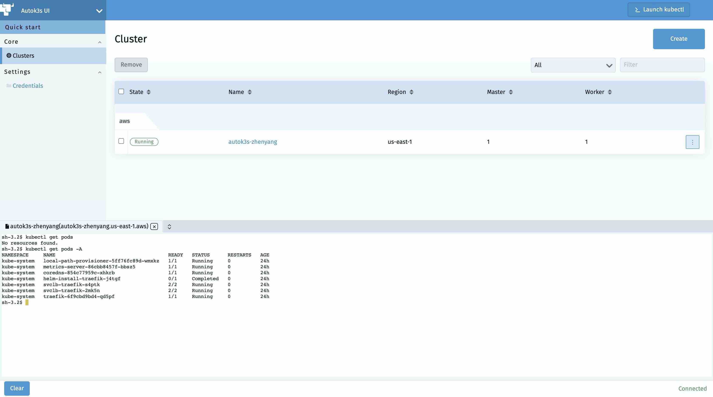
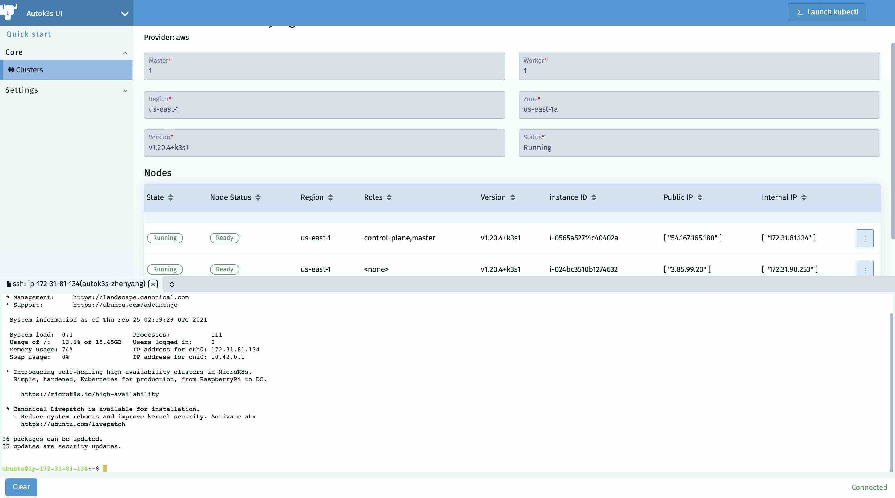

<div align="center">
  <h1>AutoK3s</h1>
  <p>
    
    
    
    
  </p>
  <span>English / </span> <a href="docs/i18n/zh_cn/README.md">简体中文</a>
</div>

<hr />

## What is AutoK3s

[K3s](https://github.com/k3s-io/k3s) is a fully certified Kubernetes offering, it can replace the "full-fat" K8s in some cases. Using K3s to create K3s clusters in public cloud providers is a complicated process. Users are required to fill in different parameters and fields in different cloud providers to create K3s clusters in them. AutoK3s is made to simplify this process.

AutoK3s is a lightweight tool for simplifying the cluster management of K3s, it can help you **Run K3s Everywhere**. You can use AutoK3s to create and launch K3s clusters, or to add nodes in existing K3s clusters. AutoK3s not only improves user experience of cluster management on cloud providers, but also inherites kubectl, which can provide users with convenient cluster management abilities. Currently, AutoK3s supports **Alibaba, Tencent, and AWS** cloud services. If the cloud providers you are using are not listed above, you can always use **native** mode to bootstrap clusters in you VM instances. We will support more cloud providers based on our user community's feedbacks.

<!-- toc -->

- [Key Features](#key-features)
- [Supported Providers](#supported-providers)
- [Frequently-used commands](#frequently-used-commands)
- [Frequently-used parameters](#frequently-used-parameters)
- [Install Script (tl;dr)](#install-script-tldr) 
- [Quick Start](#quick-start)
- [User Guide](#user-guide)
- [Local Mode](#local-mode)
- [Rancher Mode](#rancher-mode)
- [Demo Video](#demo-video)
- [Developers' Guide](#developers-guide)
- [License](#license)

<!-- /toc -->

## Key Features

- Shorter provisioning time with API, CLI and UI dashboard.
- Cloud provider Integration(simplifies the setup process of [CCM](https://kubernetes.io/docs/concepts/architecture/cloud-controller) on cloud providers).
- Flexible installation options, like K3s cluster HA and datastore(embedded etcd, RDS, SQLite, etc.).
- Low cost(try spot instances in each cloud).
- Simplify operations by UI dashboard.
- Portability between clouds by leveraging tools like [backup-restore-operator](https://github.com/rancher/backup-restore-operator).

## Supported Providers

Autok3s can support the following providers, we are happy to add more if you need:

- [aws](docs/i18n/en_us/aws/README.md) - Bootstrap K3s onto Amazon EC2
- [alibaba](docs/i18n/en_us/alibaba/README.md) - Bootstrap K3s onto Alibaba ECS
- [tencent](docs/i18n/en_us/tencent/README.md) - Bootstrap K3s onto Tencent CVM
- [native](docs/i18n/en_us/native/README.md) - Bootstrap K3s onto any VM


## Frequently-used Commands

These commands are frequently used in AutoK3s:

- `autok3s create`: To create and lauch a K3s cluster
- `autok3s join`: To add a node or multiple nodes for an existing K3s cluster.

## Frequently-used Parameters

These parameters are frequently used in AutoK3s:

- `-d` or `--debug`: To enable debug mode.
- `-p` or `--provider`: To specify which cloud provider to use.
- `-n` or `--name`: To specify the name of the cluster.
- `--master`: To specify the number of master nodes that you want to create or add.
- `--worker`: To specify the number of worker nodes that you want to create or add.

## Install Script (tl;dr)

AutoK3s is distributed as a static Go binary. You can use the shell script on MacOS and Linux, or visit the Releases page to download the executable for Windows.

```bash
curl -sS http://rancher-mirror.cnrancher.com/autok3s/install.sh  | sh
```

## Quick Start

The commands below can create a K3s cluster on Alibaba ECS.

```bash
export ECS_ACCESS_KEY_ID='<Your access key ID>'
export ECS_ACCESS_KEY_SECRET='<Your secret access key>'

autok3s -d create -p alibaba --name myk3s --master 1 --worker 1
```

## User Guide

AutoK3s has two running modes: Local Mode and Rancher Mode.

## Local Mode

In this mode, you can use Autok3s via CLI or a local UI.

### CLI

The following commands are examples for creating a K3s cluster and adding nodes for an existing cluster in `alibaba` provider. Please make sure all [prerequisites](docs/i18n/en_us/alibaba/README.md) are met before executing these commands.

#### Creating a K3s Cluster

You can use `autok3s create` command to create a K3s cluster. A typical `autok3s create` command usually includes the following args:

```bash
autok3s -d create -p <cloud provider> --name <cluster name> --master <number of master nodes> --worker <number of worker nodes>
```

**example**:

The following command uses Alibaba as cloud provider, creates a K3s cluster named "myk3s", and assign it with 1 master node and 1 worker node.

```bash
export ECS_ACCESS_KEY_ID='<Your access key ID>'
export ECS_ACCESS_KEY_SECRET='<Your secret access key>'

autok3s -d create -p alibaba --name myk3s --master 1 --worker 1
```

#### Adding Nodes for an Existing K3s Cluster

You can use `autok3s join` command to add nodes for an existing K3s cluster. A typical `autok3s join` command usually includes the following args:

```bash
autok3s -d join -p <cloud provider> --name <cluster name> --master <number of master nodes> --worker <number of worker nodes>
```

**example**:

The following command uses Alibaba as cloud provider, adds a worker node to an existing K3s cluster named "myk3s":

```bash
autok3s -d join --provider alibaba --name myk3s --worker 1
```

### UI

If you want to enable the local UI, please run `autok3s serve`.

<table>
  <tr>
      <td width="50%" align="center"><b>Quick Start</b></td>
      <td width="50%" align="center"><b>Clusters Detail</b></td>
  </tr>
  <tr>
     <td></td>
     <td></td>
  </tr>
  <tr>
      <td width="50%" align="center"><b>Operate Cluster Resources</b></td>
      <td width="50%" align="center"><b>SSH Cluster Nodes</b></td>
  </tr>
  <tr>
     <td></td>
     <td></td>
  </tr>
</table>

## Rancher Mode

In this mode, you can put Autok3s into [Rancher](https://github.com/rancher/rancher).
It will serve as an extension that allows you to build the managed K3s service.

The K3s cluster created by Autok3s can be automatically imported into Rancher, and take full advantage of Rancher's Kubernetes management capabilities.

This mode is working in progress.

## Demo Video

In the demo, we install K3s onto Alibaba ECS machines in around 1 minute.

Watch the demo:

[](https://asciinema.org/a/EL5P2ILES8GAvdlhaxLMnY8Pg)

## Developers' Guide

Use `Makefile` to manage project compilation, testing and packaging.
Of course, you can also choose to compile using `dapper`.
Install `dapper` please follow the [dapper](https://github.com/rancher/dapper) project.

- vendor: `GO111MODULE=on go mod vendor`
- compilation: `BY=dapper make autok3s`
- testing: `BY=dapper make autok3s unit`
- packing: `BY=dapper make autok3s package only`

# License

Copyright (c) 2021 [Rancher Labs, Inc.](http://rancher.com)

Licensed under the Apache License, Version 2.0 (the "License");
you may not use this file except in compliance with the License.
You may obtain a copy of the License at

[http://www.apache.org/licenses/LICENSE-2.0](http://www.apache.org/licenses/LICENSE-2.0)

Unless required by applicable law or agreed to in writing, software
distributed under the License is distributed on an "AS IS" BASIS,
WITHOUT WARRANTIES OR CONDITIONS OF ANY KIND, either express or implied.
See the License for the specific language governing permissions and
limitations under the License.
