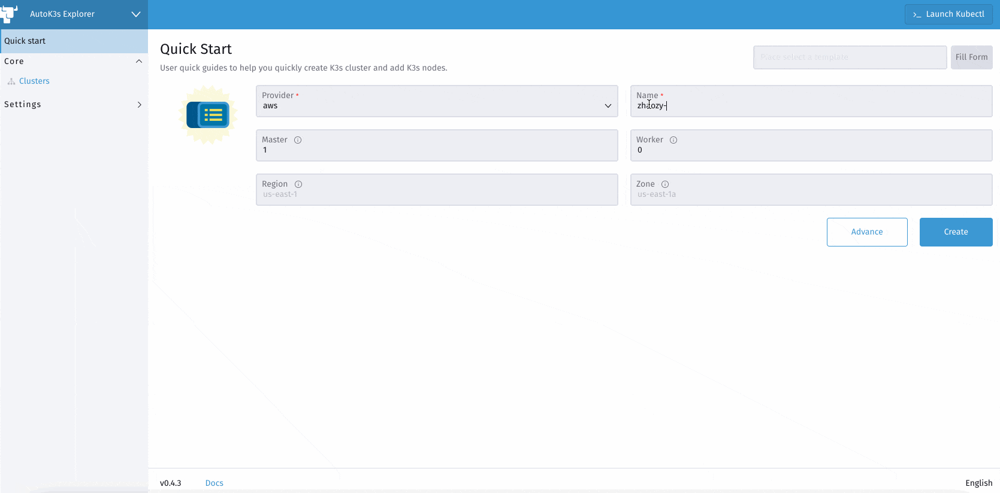

<div align="center">
  <h1>AutoK3s</h1>
  <p>
    
    
    
    
  </p>
  <span>English / </span> <a href="http://docs.rancher.cn/docs/k3s/autok3s/_index/">Simplified Chinese</a>
</div>

<hr />

## What is AutoK3s

[K3s](https://github.com/k3s-io/k3s) is a fully certified Kubernetes offering, it can replace the "full-fat" K8s in some cases.

AutoK3s is a lightweight tool for simplifying the cluster management of K3s, it can help you **Run K3s Everywhere**.

<!-- toc -->

- [Key Features](#key-features)
- [Providers](#providers)
- [Quick Start (tl;dr)](#quick-start-tldr)
- [User Guide](#user-guide)
- [Demo Video](#demo-video)
- [Developers' Guide](#developers-guide)
- [License](#license)

<!-- /toc -->

## Key Features

- Shorter provisioning time with API, CLI and UI dashboard.
- Cloud provider Integration(simplifies the setup process of [CCM](https://kubernetes.io/docs/concepts/architecture/cloud-controller) on cloud providers).
- Flexible installation options, like K3s cluster HA and datastore(embedded etcd, RDS, SQLite, etc.).
- Low cost(try spot instances in each cloud).
- Simplify operations by UI dashboard.
- Portability between clouds by leveraging tools like [backup-restore-operator](https://github.com/rancher/backup-restore-operator).

## Providers

Autok3s can support the following providers, we are happy to add more if you need:

- [aws](docs/i18n/en_us/aws/README.md) - Bootstrap K3s onto Amazon EC2
- [alibaba](docs/i18n/en_us/alibaba/README.md) - Bootstrap K3s onto Alibaba ECS
- [tencent](docs/i18n/en_us/tencent/README.md) - Bootstrap K3s onto Tencent CVM
- [k3d](docs/i18n/en_us/k3d/README.md) - Bootstrap K3d onto Local Machine
- [native](docs/i18n/en_us/native/README.md) - Bootstrap K3s onto any VM

## Quick Start (tl;dr)

Scenario 1 - Run with Docker:

```bash
# The commands will start autok3s daemon with an interactionable UI.

docker run -itd --restart=unless-stopped -p 8080:8080 cnrancher/autok3s:v0.4.3
```

Scenario 2 - Run with CLI:

```bash
# The command use the shell script on MacOS and Linux, or visit the Releases page to download the executable for Windows.

curl -sS http://rancher-mirror.cnrancher.com/autok3s/install.sh  | sh

# The commands below can create a K3s cluster on AWS EC2.

export AWS_ACCESS_KEY_ID='<Your access key ID>'
export AWS_SECRET_ACCESS_KEY='<Your secret access key>'

autok3s -d create -p aws --name myk3s --master 1 --worker 1
```

Scenario 3 - Run with Docker (Compatible K3d Provider):

```bash
# The commands will start autok3s daemon with an interactionable UI which support K3d provider.
# Highly recommend run this command on Linux/Unix.

docker run -itd --restart=unless-stopped --net host -v /var/run/docker.sock:/var/run/docker.sock cnrancher/autok3s:v0.4.3
```

## User Guide

AutoK3s has two running modes: 

- Local Mode: In this mode, you can use Autok3s via Docker or CLI.
- [WIP] Rancher Mode: In this mode, you can put Autok3s into Rancher.
  It will serve as an extension that allows you to build the managed K3s service. The K3s cluster created by Autok3s can be automatically imported into Rancher, and take full advantage of Rancher's Kubernetes management capabilities.

## Demo Video

In the demo, we install K3s onto AWS EC2 machines in around 1 minute.

Watch the demo:



## Developers' Guide

Use `Makefile` to manage project compilation, testing and packaging.

- compilation: `make autok3s build`
- testing: `make autok3s unit`
- packing: `make autok3s package only`

Use `dapper` to manage project compilation, testing and packaging.

- compilation: `BY=dapper make autok3s build`
- testing: `BY=dapper make autok3s unit`
- packing: `BY=dapper make autok3s package only`

Install `dapper` please follow the [dapper](https://github.com/rancher/dapper) project.

# License

Copyright (c) 2021 [Rancher Labs, Inc.](http://rancher.com)

Licensed under the Apache License, Version 2.0 (the "License");
you may not use this file except in compliance with the License.
You may obtain a copy of the License at

[http://www.apache.org/licenses/LICENSE-2.0](http://www.apache.org/licenses/LICENSE-2.0)

Unless required by applicable law or agreed to in writing, software
distributed under the License is distributed on an "AS IS" BASIS,
WITHOUT WARRANTIES OR CONDITIONS OF ANY KIND, either express or implied.
See the License for the specific language governing permissions and
limitations under the License.
