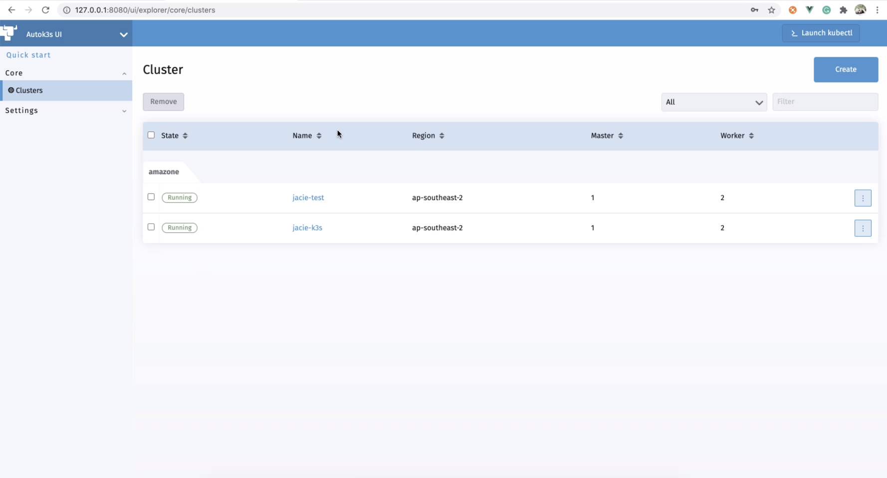

# autok3s
[](http://drone-pandaria.cnrancher.com/cnrancher/autok3s)
[](https://goreportcard.com/report/github.com/cnrancher/autok3s) 

[](http://github.com/cnrancher/autok3s/pulls)

English / [简体中文](docs/i18n/zh_cn/README.md)

[K3s](https://github.com/k3s-io/k3s) is a fully certified Kubernetes offering, it can replace the "full-fat" K8s in some cases.

AutoK3s is a lightweight tool for simplifying the cluster management of K3s, it can help you **Run K3s Everywhere**.

<!-- toc -->

- [Key Features](#key-features)
- [Providers](#providers)
- [Quick Start](#quick-start)
- [Demo Video](#demo-video)
- [Developers' Guide](#developers-guide)
- [License](#license)

<!-- /toc -->

## Key Features

- Quick provisioning time with API, CLI and UI dashboard
- Cloud provider Integration(simplify setting up [CCM](https://kubernetes.io/docs/concepts/architecture/cloud-controller) of each cloud)
- Flexible installation options, like K3s cluster HA and datastore(embedded etcd, RDS, SQLite, etc.)
- Low cost(try spot instances in each cloud)
- Simplify operations by UI dashboard
- Portability between clouds by leveraging tools like [backup-restore-operator](https://github.com/rancher/backup-restore-operator)

## Providers

Autok3s can support the following providers, we are happy to add more if you need:

- [alibaba](docs/i18n/en_us/alibaba/README.md) - Bootstrap K3s onto Alibaba ECS
- [tencent](docs/i18n/en_us/tencent/README.md) - Bootstrap K3s onto Tencent CVM
- [native](docs/i18n/en_us/native/README.md) - Bootstrap K3s onto any VM
- [aws](docs/i18n/en_us/aws/README.md) - Bootstrap K3s onto Amazon EC2

## Quick Start

Autok3s can run in two different modes: Local mode and Rancher mode.

### Local Mode

In this mode, you can use Autok3s via CLI or a local UI.

The following commands use the `alibaba` provider, please check the [prerequisites](docs/i18n/en_us/alibaba/README.md) before you run that:

```bash
export ECS_ACCESS_KEY_ID='<Your access key ID>'
export ECS_ACCESS_KEY_SECRET='<Your secret access key>'

autok3s -d create -p alibaba --name myk3s --master 1 --worker 1
```

If you want to enable the local UI, please run `autok3s serve` .



### Rancher Mode

In this mode, you can put Autok3s into [Rancher](https://github.com/rancher/rancher).
It will serve as an extension that allows you to build the managed K3s service.

The K3s cluster created by Autok3s can be automatically imported into Rancher, and take full advantage of Rancher's Kubernetes management capabilities.

This mode is working in progress.

## Demo Video

In the demo, we install K3s onto Alibaba ECS machines in around 1 minute.

Watch the demo:

[](https://asciinema.org/a/EL5P2ILES8GAvdlhaxLMnY8Pg)

## Developers' Guide

Use `Makefile` to manage project compilation, testing and packaging.
Of course, you can also choose to compile using `dapper`.
Install `dapper` please follow the [dapper](https://github.com/rancher/dapper) project.

- vendor: `GO111MODULE=on go mod vendor`
- compilation: `BY=dapper make autok3s`
- testing: `BY=dapper make autok3s unit`
- packing: `BY=dapper make autok3s package only`

# License

Copyright (c) 2021 [Rancher Labs, Inc.](http://rancher.com)

Licensed under the Apache License, Version 2.0 (the "License");
you may not use this file except in compliance with the License.
You may obtain a copy of the License at

[http://www.apache.org/licenses/LICENSE-2.0](http://www.apache.org/licenses/LICENSE-2.0)

Unless required by applicable law or agreed to in writing, software
distributed under the License is distributed on an "AS IS" BASIS,
WITHOUT WARRANTIES OR CONDITIONS OF ANY KIND, either express or implied.
See the License for the specific language governing permissions and
limitations under the License.
