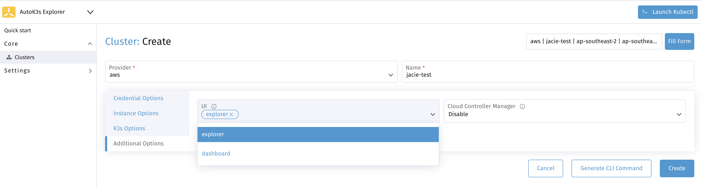
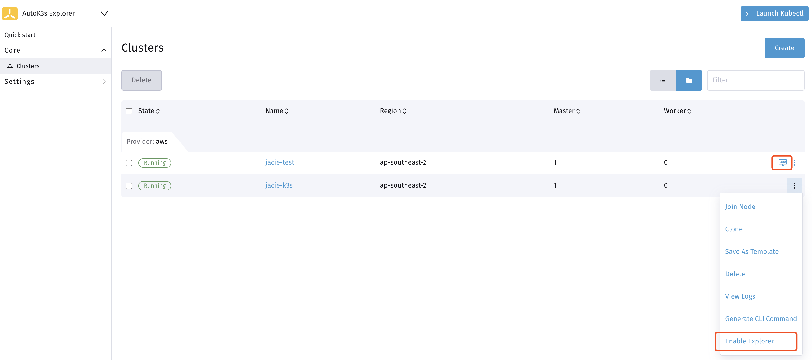

# Harvester Provider

> Harvester provider is only supported in autok3s <= v0.6.1.

## Introduction

This article provides users with the instructions to create and launch a K3s cluster using Harvester VMs, and to add nodes for an existing K3s cluster on Harvester VMs. In addition, this article provides guidance of advanced usages of running K3s on Harvester VM, such as setting up private registry, and enabling UI components.

## Prerequisites

Please prepare a Harvester Cluster first before using harvester provider and save kubeconfig file for Harvester Cluster.

### Setting up Environment

Configure the following environment variables for the host on which you are running `autok3s`.

```bash
export HARVESTER_KUBECONFIG_FILE='<your harvester kubeconfig file path>'
```

### Prepare images and networks

Before using harvester provider, please upload your OS-image to ensure create VMs. For more details about upload images, please refer [here](https://docs.harvesterhci.io/v1.0/upload-image/).

Harvester providers two types of networks:

- Management Network
- VLAN Network

Harvester uses canal as its default management network. It is a built-in network that can be used directly from the cluster. By default, the management network IP of a VM can only be accessed within the cluster nodes, and the management network IP will not remain unchanged after the VM reboot.

If you're using `autok3s` outside Harvester cluster, you can't use the default Management Network.

Please prepare a VLAN Network to ensure `autok3s` can access to Harvester VMs. For more details about Network, please refer [here](https://docs.harvesterhci.io/v1.0/networking/harvester-network/)

These two factors will use for `--image-name` and `--network-name` parameters.

If you are creating VMs under different namespaces with image or network, please try like this `--vm-namespace <vm-namespace> --image-name <imageNamespace/imageName> --network-name <networkNamespace/networkName>`

## Creating a K3s cluster

Please use `autok3s create` command to create a cluster in your Harvester cluster.

### Normal Cluster

The following command uses harvester provider, creates a K3s cluster named "myk3s", and assign it with 1 master node and 1 worker node:

```bash
autok3s -d create \
    --provider harvester \
    --name myk3s \
    --image-name <harvester image> \
    --network-name <vlan network name> \
    --master 1 \
    --worker 1
```

### HA Cluster

Please use one of the following commands to create an HA cluster.

#### Embedded etcd

The following command uses harvester provider, creates an HA K3s cluster named "myk3s", and assigns it with 3 master nodes.

```bash
autok3s -d create \
    --provider harvester \
    --name myk3s \
    --image-name <harvester image> \
    --network-name <vlan network name> \
    --master 3 \
    --cluster
```

#### External Database

The following requirements must be met before creating an HA K3s cluster with an external database:

- The number of master nodes in this cluster must be greater or equal to 1.
- The external database information must be specified within `--datastore "PATH"` parameter.

In the example below, `--master 2` specifies the number of master nodes to be 2, `--datastore "PATH"` specifies the external database information. As a result, requirements listed above are met.

Run the command below and create an HA K3s cluster with an external database:

```bash
autok3s -d create \
    --provider harvester \
    --name myk3s \
    --image-name <harvester image> \
    --network-name <vlan network name> \
    --master 2 \
    --datastore "mysql://<user>:<password>@tcp(<ip>:<port>)/<db>"
```

## Join K3s Nodes

Please use `autok3s join` command to add one or more nodes for an existing K3s cluster.

### Normal Cluster

The command below shows how to add a worker node for an existing K3s cluster named "myk3s".

```bash
autok3s -d join --provider harvester --name myk3s --worker 1
```

### HA Cluster

The commands to add one or more nodes for an existing HA K3s cluster varies based on the types of HA cluster. Please choose one of the following commands to run.

```bash
autok3s -d join --provider harvester --name myk3s --master 2 --worker 1
```

## Delete K3s Cluster

This command will delete a k3s cluster named "myk3s".

```bash
autok3s -d delete --provider harvester --name myk3s
```

## List K3s Clusters

This command will list the clusters that you have created on this machine.

```bash
autok3s list
```

```bash
  NAME   REGION  PROVIDER   STATUS   MASTERS  WORKERS    VERSION
  myk3s          harvester  Running  1        0        v1.22.6+k3s1
```

## Describe k3s cluster

This command will show detail information of a specified cluster, such as instance status, node IP, kubelet version, etc.

```bash
autok3s describe -n <clusterName> -p harvester
```

> Note：There will be multiple results if using the same name to create with different providers, please use `-p <provider>` to choose a specified cluster. i.e. `autok3s describe cluster myk3s -p harvester`

```bash
Name: myk3s
Provider: harvester
Region:
Zone:
Master: 1
Worker: 2
Status: Running
Version: v1.22.6+k3s1
Nodes:
  - internal-ip: [x.x.x.x]
    external-ip: [x.x.x.x]
    instance-status: Running
    instance-id: autok3s-myk3s-76mfl
    roles: <none>
    status: Ready
    hostname: autok3s-myk3s-76mfl
    container-runtime: containerd://1.5.9-k3s1
    version: v1.22.6+k3s1
```

## Access K3s Cluster

After the cluster is created, `autok3s` will automatically merge the `kubeconfig` so that you can access the cluster.

```bash
autok3s kubectl config use-context myk3s.myns.harvester
autok3s kubectl <sub-commands> <flags>
```

In the scenario of multiple clusters, the access to different clusters can be completed by switching context.

```bash
autok3s kubectl config get-contexts
autok3s kubectl config use-context <context>
```

## SSH K3s Cluster's Node

Login to a specific k3s cluster node via ssh, i.e. myk3s.

```bash
autok3s ssh --provider harvester --name myk3s
```

## Upgrade K3s Cluster

The following command will help you to upgrade your K3s cluster version to latest version.

```
autok3s upgrade --provider harvester --name myk3s --k3s-channel latest
```

If you want to upgrade K3s cluster to a specified version, you can use `--k3s-version` to overrides `--k3s-channel`.

```
autok3s upgrade --provider harvester --name myk3s --k3s-version v1.22.4+k3s1
```

## Other Usages

More usage details please running `autok3s <sub-command> --provider harvester --help` commands.

## Advanced Usages

We integrate some advanced components such as private registries and UI, related to the current provider.

### Setting up Private Registry

Below are examples showing how you may configure `/etc/autok3s/registries.yaml` on your current node when using TLS, and make it take effect on k3s cluster by `autok3s`.

```bash
mirrors:
  docker.io:
    endpoint:
      - "https://mycustomreg.com:5000"
configs:
  "mycustomreg:5000":
    auth:
      username: xxxxxx # this is the registry username
      password: xxxxxx # this is the registry password
    tls:
      cert_file: # path to the cert file used in the registry
      key_file:  # path to the key file used in the registry
      ca_file:   # path to the ca file used in the registry
```

When running `autok3s create` or `autok3s join` command, it will take effect with the`--registry /etc/autok3s/registries.yaml` flag, i.e:

```bash
autok3s -d create \
    --provider harvester \
    --name myk3s \
    --image-name <harvester image> \
    --network-name <vlan network name> \
    --master 1 \
    --worker 1 \
    --registry /etc/autok3s/registries.yaml
```

### Enable UI Component

AutoK3s support [cnrancher/kube-explorer](https://github.com/cnrancher/kube-explorer) as UI Component.

#### Enable kube-explorer dashboard

You can enable kube-explorer using following command.

```bash
autok3s explorer --context myk3s.myns.harvester --port 9999
```

You can enable kube-explorer when creating K3s Cluster by UI.



You can also enable/disable kube-explorer any time from UI, and access kube-explorer dashboard by `dashboard` button.


