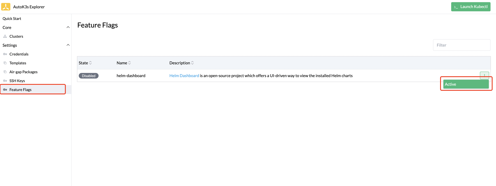
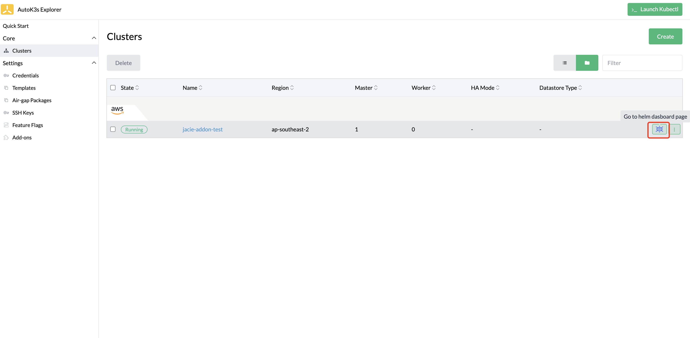

# Native Provider

## Introduction

This article provides users with the instructions to create and launch a K3s cluster on a virtual machine(VM), and to add nodes for an existing K3s cluster on the VM. In addition, this article provides guidance of advanced usages of running K3s on VM, such as setting up private registry, and enabling UI components.

## Prerequisites

### Operating System on VM

You will need a VM that is capable of running popular Linux distributions such as **Ubuntu, Debian and Raspbian**, and register or set `SSH key/password` for them.

### Setting up Security Group

The VM needs to apply the following **minimum** Security Group Rules:

<details>

```bash
Rule        Protocol    Port      Source             Description
InBound     TCP         22        ALL                SSH Connect Port
InBound     TCP         6443      K3s agent nodes    Kubernetes API
InBound     TCP         10250     K3s server & agent Kubelet
InBound     TCP         8999      K3s dashboard      (Optional) Required only for Dashboard UI
InBound     UDP         8472      K3s server & agent (Optional) Required only for Flannel VXLAN
InBound     TCP         2379,2380 K3s server nodes   (Optional) Required only for embedded ETCD
OutBound    ALL         ALL       ALL                Allow All
```

</details>

## Creating a K3s cluster

Please use `autok3s create` command to create a cluster in your VM.

### Normal Cluster

The following command creates a K3s cluster named "myk3s", and assign it with 2 master nodes and 2 worker nodes:

```bash
autok3s -d create \
    --provider native \
    --name myk3s \
    --ssh-user <ssh-user> \
    --ssh-key-path <ssh-key-path> \
    --master-ips <master-ip-1,master-ip-2> \
    --worker-ips <worker-ip-1,worker-ip-2>
```

### HA Cluster

Please use one of the following commands to create an HA cluster.

#### Embedded etcd

The following command creates an HA K3s cluster named "myk3s", and assigns it with 3 master nodes.

```bash
autok3s -d create \
    --provider native \
    --name myk3s \
    --ssh-user <ssh-user> \
    --ssh-key-path <ssh-key-path> \
    --master-ips <master-ip-1,master-ip-2,master-ip-3> \
    --cluster
```

#### External Database

The following requirements must be met before creating an HA K3s cluster with an external database:

- The number of master nodes in this cluster must be greater or equal to 1.
- The external database information must be specified within `--datastore "PATH"` parameter.

In the example below, `--master-ips <master-ip-1,master-ip-2>` specifies the number of master nodes to be 2, `--datastore "PATH"` specifies the external database information. As a result, requirements listed above are met.

Run the command below and create an HA K3s cluster with an external database:

```bash
autok3s -d create \
    --provider native \
    --name myk3s \
    --ssh-user <ssh-user> \
    --ssh-key-path <ssh-key-path> \
    --master-ips <master-ip-1,master-ip-2> \
    --datastore "mysql://<user>:<password>@tcp(<ip>:<port>)/<db>"
```

### Advanced Settings

The AutoK3s supports more advanced settings to customize your K3s cluster.

#### Installation Environments

If you want to add more installation environments, please set the args below:

```bash
--install-env INSTALL_K3S_SKIP_SELINUX_RPM=true --install-env  INSTALL_K3S_FORCE_RESTART=true
```

> We recommend you to only use INSTALL_* parameters for this case because this is a global setting to your K3s cluster. If you want to set the K3S_* environments, please use the K3s configuration file args.

#### Server/Agent Configuration File

In addition to configuring K3s with environment variables and CLI arguments, K3s can also use a config file.

If you want to do more customize and complex configurations for your K3s cluster, such as etcd snapshot or datastore. This arg is what you need.

Here's an example of a K3s server configuration with etcd snapshot information and change the node port range.
```yaml
etcd-snapshot-schedule-cron: "* * * * *"
etcd-snapshot-retention: 15
service-node-port-range: "20000-30000"
```

Save this yaml file to your local path, such as `myk3s-server-config.yaml`. Then pass this file by the following arg:

```bash
--server-config-file /your/path/myk3s-server-config.yaml
```

If you want to set the configuration file to your agent node, use the arg `--agent-config-file /your/path/agent-config.yaml`

## Join K3s Nodes

Please use `autok3s join` command to add one or more nodes for an existing K3s cluster.

### Normal Cluster

The command below shows how to add 2 worker nodes for an existing K3s cluster named "myk3s".

```bash
autok3s -d join \
    --provider native \
    --name myk3s \
    --ssh-user <ssh-user> \
    --ssh-key-path <ssh-key-path> \
    --worker-ips <worker-ip-2,worker-ip-3>
```

If you want to join a worker node to an existing K3s cluster which is not handled by AutoK3s, please use the following command.

> PS: The existing cluster is not handled by AutoK3s, so it's better to use the same ssh connect information for both master node and worker node so that we can access both VM with the same ssh config.

```bash
autok3s -d join \
    --provider native \
    --name myk3s \
    --ip <master-ip> \
    --ssh-user <ssh-user> \
    --ssh-key-path <ssh-key-path> \
    --worker-ips <worker-ip>
```

### HA Cluster

The commands to add one or more nodes for an existing HA K3s cluster varies based on the types of HA cluster. Please choose one of the following commands to run.

#### Embedded etcd

Run the command below, to add 2 master nodes for an Embedded etcd HA cluster(embedded etcd: >= 1.19.1-k3s1).

```bash
autok3s -d join \
    --provider native \
    --name myk3s \
    --ssh-user <ssh-user> \
    --ssh-key-path <ssh-key-path> \
    --master-ips <master-ip-2,master-ip-3>
```

#### External Database

Run the command below, to add 2 master nodes for an HA cluster with external database, you will need to fill in `--datastore "PATH"` as well.

```bash
autok3s -d join \
    --provider native \
    --name myk3s \
    --ssh-user <ssh-user> \
    --ssh-key-path <ssh-key-path> \
    --master-ips <master-ip-2,master-ip-3> \
    --datastore "mysql://<user>:<password>@tcp(<ip>:<port>)/<db>"
```

## Delete K3s Cluster

This command will delete a k3s cluster named "myk3s".

```bash
autok3s -d delete --provider native --name myk3s
```

> PS: If the cluster is an existing K3s cluster which is not handled by AutoK3s, we won't uninstall it when delete the cluster from AutoK3s.

## List K3s Clusters

This command will list the clusters that you have created on this machine.

```bash
autok3s list
```

```bash
   NAME     REGION  PROVIDER  STATUS   MASTERS  WORKERS    VERSION
  myk3s             native    Running  1        0        v1.22.6+k3s1
```

## Describe k3s cluster

This command will show detail information of a specified cluster, such as instance status, node IP, kubelet version, etc.

```bash
autok3s describe -n <clusterName> -p native
```

> Note：There will be multiple results if using the same name to create with different providers, please use `-p <provider>` to choose a specified cluster. i.e. `autok3s describe cluster myk3s -p native`

```bash
Name: myk3s
Provider: native
Region:
Zone:
Master: 1
Worker: 0
Status: Running
Version: v1.22.6+k3s1
Nodes:
  - internal-ip: [x.x.x.x]
    external-ip: [x.x.x.x]
    instance-status: -
    instance-id: xxxxxxxxxx
    roles: control-plane,master
    status: Ready
    hostname: test
    container-runtime: containerd://1.5.9-k3s1
    version: v1.22.6+k3s1
```

## Access K3s Cluster

After the cluster is created, `autok3s` will automatically merge the `kubeconfig` so that you can access the cluster.

```bash
autok3s kubectl config use-context myk3s
autok3s kubectl <sub-commands> <flags>
```

In the scenario of multiple clusters, the access to different clusters can be completed by switching context.

```bash
autok3s kubectl config get-contexts
autok3s kubectl config use-context <context>
```

## SSH K3s Cluster's Node

Login to a specific k3s cluster node via ssh, i.e. myk3s.

```bash
autok3s ssh --provider native --name myk3s
```

> If the cluster is an existing one which is not handled by AutoK3s, you can't use Execute Shell from UI, but you can access the cluster nodes via CLI.

If the ssh config is different between the existing nodes and current nodes(joined with AutoK3s), you can use the command below to switch the ssh config

```bash
autok3s ssh --provider native --name myk3s <ip> --ssh-user ubuntu --ssh-key-path ~/.ssh/id_rsa
```

## Upgrade K3s Cluster

The following command will help you to upgrade your K3s cluster version to latest version.

```
autok3s upgrade --provider native --name myk3s --k3s-channel latest
```

If you want to upgrade K3s cluster to a specified version, you can use `--k3s-version` to overrides `--k3s-channel`.

```
autok3s upgrade --provider native --name myk3s --k3s-version v1.22.4+k3s1
```

## Other Usages

More usage details please running `autok3s <sub-command> --provider native --help` commands.

## Advanced Usages

We integrate some advanced components such as private registries and UI related to the current provider.

### Setting up Private Registry

When running `autok3s create` or `autok3s join` command, it takes effect with the`--registry /etc/autok3s/registries.yaml` flag, i.e.:

```bash
autok3s -d create \
    --provider native \
    --name myk3s \
    --ssh-user <ssh-user> \
    --ssh-key-path <ssh-key-path> \
    --master-ips <master-ip-1,master-ip-2> \
    --worker-ips <worker-ip-1,worker-ip-2> \
    --registry /etc/autok3s/registries.yaml
```

Below are examples showing how you may configure `/etc/autok3s/registries.yaml` on your current node when using TLS, and make it take effect on k3s cluster by `autok3s`.

```bash
mirrors:
  docker.io:
    endpoint:
      - "https://mycustomreg.com:5000"
configs:
  "mycustomreg:5000":
    auth:
      username: xxxxxx # this is the registry username
      password: xxxxxx # this is the registry password
    tls:
      cert_file: # path to the cert file used in the registry
      key_file:  # path to the key file used in the registry
      ca_file:   # path to the ca file used in the registry
```

### Enable UI Component

AutoK3s support [cnrancher/kube-explorer](https://github.com/cnrancher/kube-explorer) as UI Component.

#### Enable kube-explorer dashboard

You can enable kube-explorer using following command.

```bash
autok3s explorer --context myk3s --port 9999
```

You can enable kube-explorer when creating K3s Cluster by UI.


You can also enable/disable kube-explorer any time from UI, and access kube-explorer dashboard by `Explorer` button.


### Enable helm-dashboard

You can enable helm-dashboard using the following command.

```bash
autok3s helm-dashboard --port 8888
```

After the server started success, you can access the helm-dashboard by `http://127.0.0.1:8888`

You can also enable/disable helm-dashboard any time from UI, and access helm-dashboard by `dashboard` button.




> PS: You can only enable helm-dashboard when you have a cluster at least.
