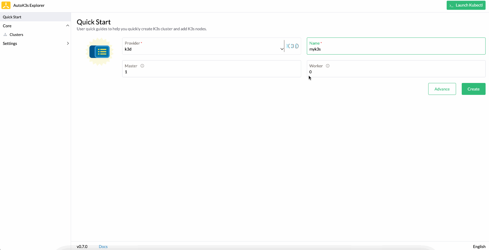

## 什么是 AutoK3s

[K3s](https://github.com/k3s-io/k3s) 是经过完全认证的 Kubernetes 产品，在某些情况下可以替代完整的 K8s。

AutoK3s 是用于简化 K3s 集群管理的轻量级工具，您可以使用 AutoK3s 在任何地方运行 K3s 服务。

## 关键特性

- 通过 API、CLI 和 UI 等方式快速创建 K3s。
- 云提供商集成（简化 [CCM](https://kubernetes.io/docs/concepts/architecture/cloud-controller) 设置）。
- 灵活安装选项，例如 K3s 集群 HA 和数据存储（内置 etcd、RDS、SQLite 等）。
- 低成本（尝试云中的竞价实例）。
- 通过 UI 简化操作。
- 多云之间弹性迁移，借助诸如 [backup-restore-operator](https://github.com/rancher/backup-restore-operator) 这样的工具进行弹性迁移。
- [K3s离线安装](airgap/README.md)，K3s离线安装包管理以及使用离线安装方式部署集群。
- [SSH Key管理](sshkey/README.md)，管理连接服务器的 SSH Key，用于部署 K3s 集群使用。
- [插件管理](add-on/README.md)，简化插件的管理和部署，将应用程序无缝集成到 K3s 集群中。

## 云提供商

AutoK3s 可以支持以下云厂商，我们会根据社区反馈添加更多支持：

- [阿里云](alibaba/README.md) - 在阿里云的 ECS 中初始化 K3s 集群
- [AWS](aws/README.md) - 在亚马逊 EC2 中初始化 K3s 集群
- [Google](google/README.md) - 在Google GCE 中初始化 K3s 集群
- [腾讯云](tencent/README.md) - 在腾讯云 CVM 中初始化 K3s 集群
- [Native](native/README.md) - 在任意类型 VM 实例中初始化 K3s 集群
- [K3d](k3d/README.md) - 使用 K3d 在宿主机 Docker 中初始化 K3s 集群

## 快速体验

您可以通过以下 Docker 命令，一键启动 AutoK3s 本地 UI，快速体验相关功能。

```bash
docker run -itd --restart=unless-stopped -p 8080:8080 cnrancher/autok3s:v0.9.2
```

如果您想要在 docker 中使用 K3d provider，那么您需要使用宿主机网络启动 AutoK3s 镜像。

```bash
docker run -itd --restart=unless-stopped --net host -v /var/run/docker.sock:/var/run/docker.sock cnrancher/autok3s:v0.9.2
```

如果您是 MacOS 或者 Linux 系统，您也可以使用以下安装命令，一键安装 AutoK3s（Windows用户请前往 [Releases](https://github.com/cnrancher/autok3s/releases) 页面下载对应的程序）。

```bash
curl -sS https://rancher-mirror.rancher.cn/autok3s/install.sh  | INSTALL_AUTOK3S_MIRROR=cn sh
```

您可以通过以下 CLI 命令启动服务，启动成功后会直接弹出默认浏览器，显示 AutoK3s 提供的本地 UI。

```bash
autok3s serve
```

您也可以通过以下 CLI 在 AWS EC2 快速创建一个 1 master, 1 worker 节点的 K3s 集群。

```bash
export AWS_ACCESS_KEY_ID='<Your access key ID>'
export AWS_SECRET_ACCESS_KEY='<Your secret access key>'

autok3s -d create -p aws --name myk3s --master 1 --worker 1
```

## 卸载 AutoK3s

> v0.5.0 及更新版本可用

如果您想卸载 AutoK3s，可以执行以下命令：

```bash
/usr/local/bin/autok3s-uninstall.sh
```

## 演示视频

在以下演示中，我们将在 1 分钟左右的时间内通过 K3d 启动 K3s集群，并且我们将使用集成在 AutoK3s 中的 kube-explorer 工具，对不同 K3s 集群的资源进行管理。

观看演示：


## 升级

如果您使用 Docker 命令一键启动 AutoK3s 本地 UI，从 `v0.4.0` 升级到 `v0.9.2` 需要进行如下操作以保证历史数据的迁移。

```bash
docker cp <old-container>:/root/.autok3s .
docker rm -f <old-container>
docker run -itd --restart=unless-stopped -p 8080:8080 -v $PWD/.autok3s:/root/.autok3s cnrancher/autok3s:v0.9.2
```

在 `v0.4.1` 以后的版本，可以直接通过 `--volumes-from` 来保证历史数据的迁移。

```bash
docker stop <old-container>
docker run -itd --restart=unless-stopped -p 8080:8080 --volumes-from <old-container> cnrancher/autok3s:v0.9.2
```

## 开发者指南

使用 `dapper` 管理项目的编译、测试与打包

- 编译： `make autok3s build`
- 测试： `make autok3s unit`
- 打包： `make autok3s package only`

请参考[dapper](https://github.com/rancher/dapper)项目来安装 `dapper`

## 源码

AutoK3s是 100% 开源的软件，该项目相关的源码包括：

- https://github.com/cnrancher/autok3s
- https://github.com/cnrancher/autok3s-ui
- https://github.com/cnrancher/kube-explorer

# License

Copyright (c) 2023 [Rancher Labs, Inc.](http://rancher.com)

Licensed under the Apache License, Version 2.0 (the "License");
you may not use this file except in compliance with the License.
You may obtain a copy of the License at

[http://www.apache.org/licenses/LICENSE-2.0](http://www.apache.org/licenses/LICENSE-2.0)

Unless required by applicable law or agreed to in writing, software
distributed under the License is distributed on an "AS IS" BASIS,
WITHOUT WARRANTIES OR CONDITIONS OF ANY KIND, either express or implied.
See the License for the specific language governing permissions and
limitations under the License.