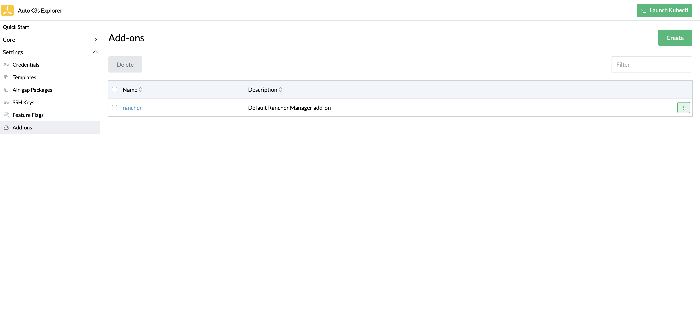
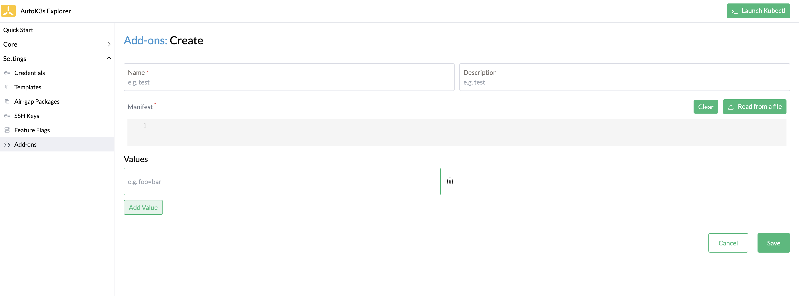
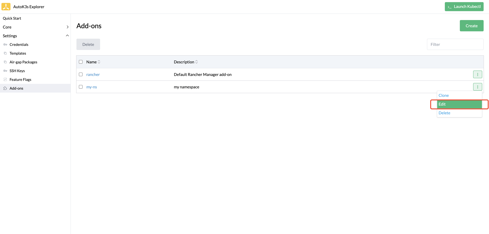
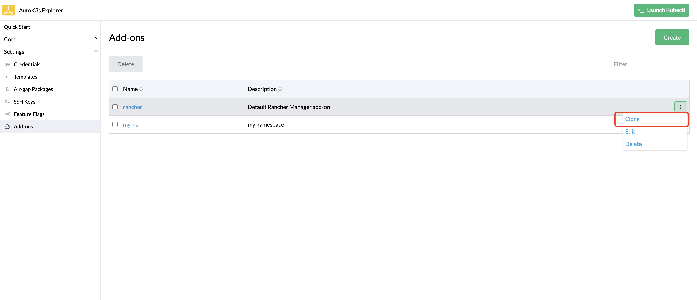
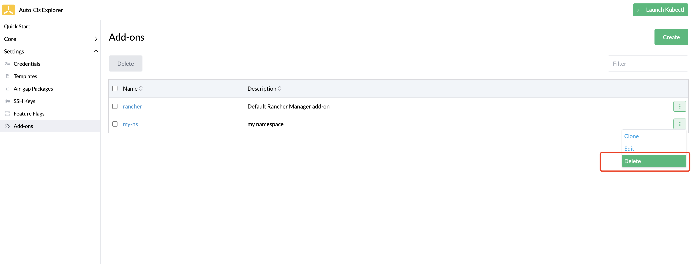
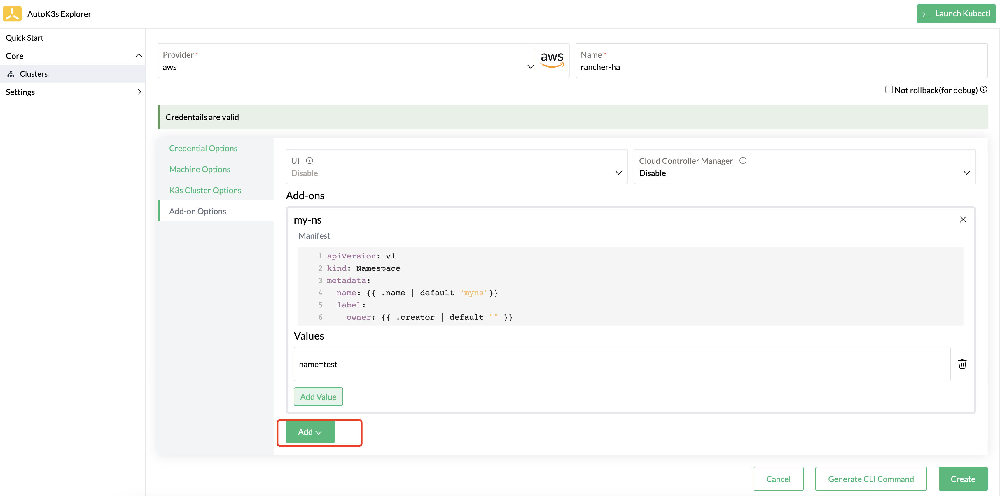

# 插件管理

## 概述

本文介绍 AutoK3s 插件管理以及在部署集群时使用插件快速部署应用的功能。

## UI 使用说明

接下来我们基于 AutoK3s UI 介绍如何进行插件管理以及部署 K3s 集群时使用已有插件快速部署应用的功能。如果您想了解 CLI 的使用，请移步到 [基础命令](#基础命令)

您可以通过[快速体验](../README.md#快速体验)中的描述，通过 Docker 或者 CLI 启动本地 UI，打开浏览器，访问目标端口 `8080` 即可。

### 插件管理

在左侧菜单选择 `Settings` > `Add-ons` 进入插件管理页面，在页面中我们可以看到内置的插件。



### 创建插件

点击 `Create` 按钮可以创建一个新的插件。



**表 1：创建插件参数**

| 参数             | 说明                       
|:---------------|:-------------------------
| Name           | 插件名称                     
| Description    | 插件描述                     
| Manifest       | 插件 Manifest YAML 文件内容   
| Values         | 用于替换 Manifest YAML 中的变量值

点击 `Save` 按钮保存插件信息。

### 修改插件

如果想更新插件，点击指定插件右侧的 `Edit` 按钮。



### 克隆插件

如果想基于已有插件快速创建新插件，可以使用克隆功能，点击指定插件右侧的 `Clone` 按钮。



### 删除插件

点击指定插件右侧的 `Delete` 按钮，即可删除插件。



### 创建集群启用插件

在创建集群时启用插件，可以在创建集群页面的 `Add-on Options Tab` 中的 Add-ons 属性中设置。



在下拉列表中可以从已有的插件列表中选择要开启的插件，选中插件后，可以看到已经设置的插件 Values 参数，可以对相关参数进行添加及修改。
一次可以添加多个插件，但每个插件只能启用一次。

## 基础命令

新增子命令 `autok3s add-ons`，用于管理附加插件。以下是命令帮助详情：

```sh
Usage:
  autok3s add-ons [command]

Available Commands:
  create      Create a new add-on
  get         Get an add-on information.
  list        List all add-on list.
  rm          Remove an add-on.
  update      Update manifest for an add-on

Flags:
  -h, --help   help for add-ons

Global Flags:
  -d, --debug   Enable log debug level

Global Environments:
  AUTOK3S_CONFIG  Path to the cfg file to use for CLI requests (default ~/.autok3s)
  AUTOK3S_RETRY   The number of retries waiting for the desired state (default 20)

Use "autok3s add-ons [command] --help" for more information about a command.
```

### 创建插件

使用命令 `autok3s add-ons create <name>` 创建一个新的插件，必须参数为 `--from` 或 `-f` 指定插件的 Manifest YAML 文件路径。

Manifest YAML 文件内容既可以是已有的 Helm Chart，内容可参考 [这里](https://docs.k3s.io/zh/helm)
也可以直接部署 K8s 资源，例如 K3s 内置的 [local-storage 插件](https://github.com/k3s-io/k3s/blob/master/manifests/local-storage.yaml)

```sh
autok3s add-ons create my-ns -f ~/myapp.yaml --description "my namespace" --set name=test01 --set creator=jacie
```

如果使用helm chart，想要替换某些变量值，可以使用 `--set` 参数来替换。

AutoK3s 默认内置了 Rancher Manager 插件，可以通过 `autok3s add-ons get rancher` 来查看。

### 更新插件

使用命令 `autok3s add-ons update <name>` 更新指定的插件，可以替换 manifest 文件内容，也可以通过 `--unset` 取消 values 属性。

```sh
autok3s add-ons update rancher --unset Version
```

### 插件列表

使用命令 `autok3s add-ons list` 查看插件列表

```
   NAME             DESCRIPTION            VALUES
  rancher  Default Rancher Manager add-on  0
  my-ns    my namespace                    2
```

### 插件详情

使用命令 `autok3s add-ons get <name>` 查看指定的插件内容。

```sh
Description: my namespace
Manifest: |
  apiVersion: v1
  kind: Namespace
  metadata:
    name: {{ .name | default "myns"}}
    label:
      owner: {{ .creator | default "" }}
Name: my-ns
Values:
  creator: jacie
  name: test01
```

### 删除插件

使用命令 `autok3s add-ons rm <name>` 删除指定的插件。

### 创建集群时使用插件部署应用

在使用 AutoK3s 创建集群时，可以通过 `--enable` 参数指定部署已有的插件，可以在 K3s 集群启动后自动部署指定应用。

```sh
autok3s create -p aws -n myk3s \
    ... \
    --enable rancher \
    --enable my-ns \
    --set rancher.Version=v2.7.2 \
    --set my-ns.name=test
```

`--enable` 可以指定多个插件，需要与设置的 add-on 名称一致。

`--set` 参数需要指定 add-on 名称的前缀，以区分不同插件的参数值。如果已经在插件管理页面设置过插件的 Values 参数，在创建集群时可以不额外指定，如果同时指定了 Values 参数，则会以创建集群的 Values 参数作为最终替换内容。
