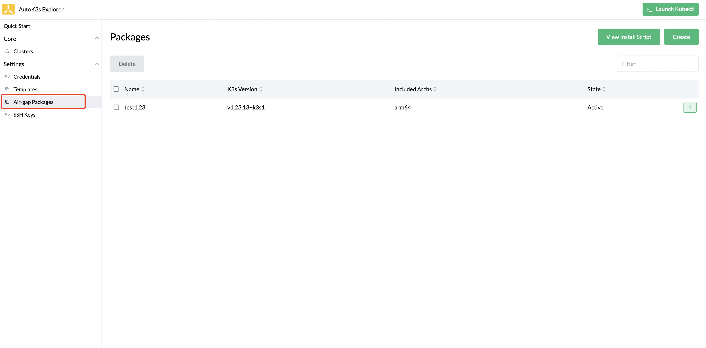
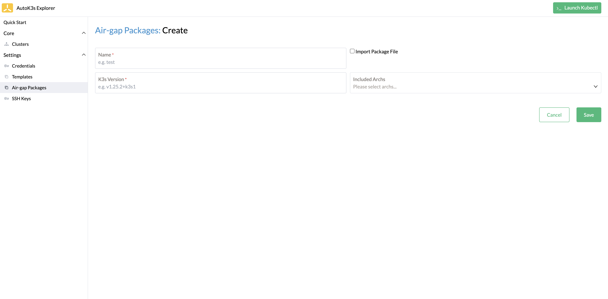
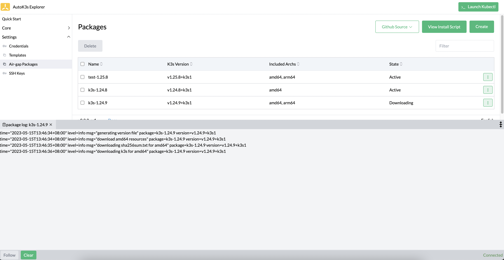
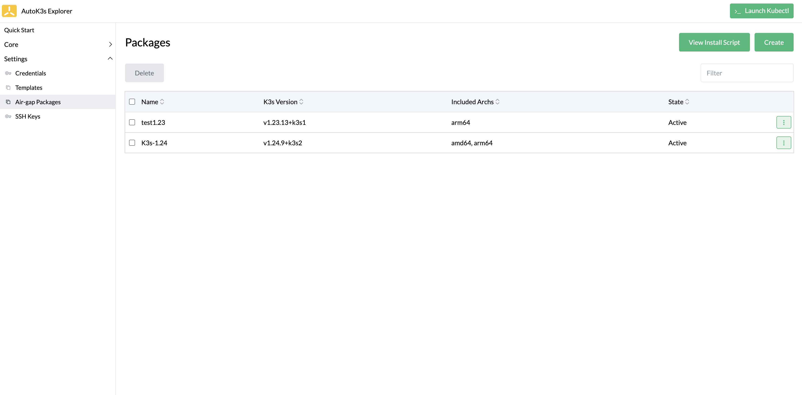
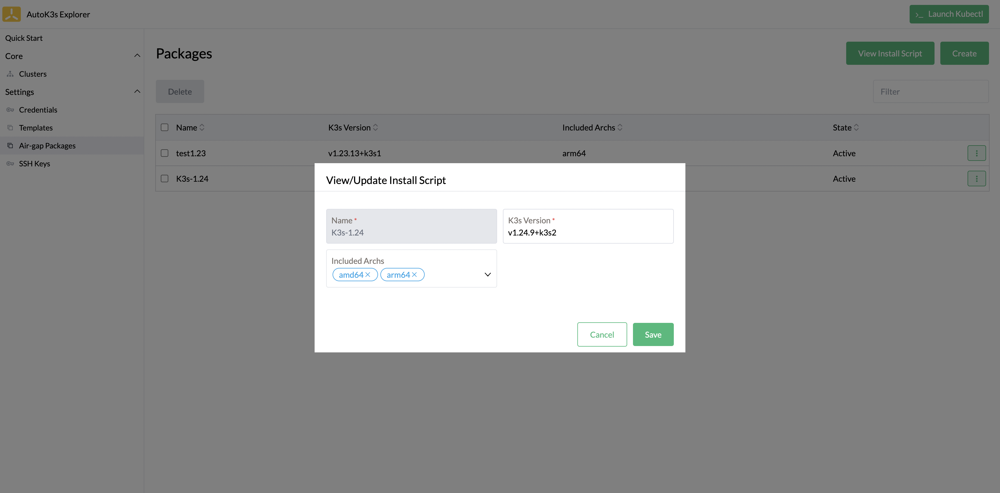
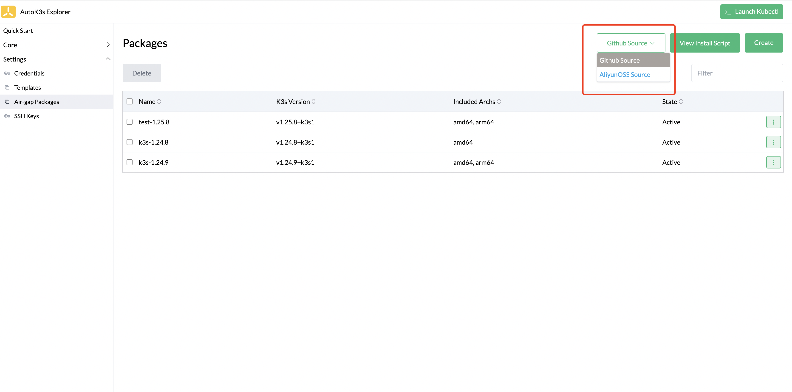
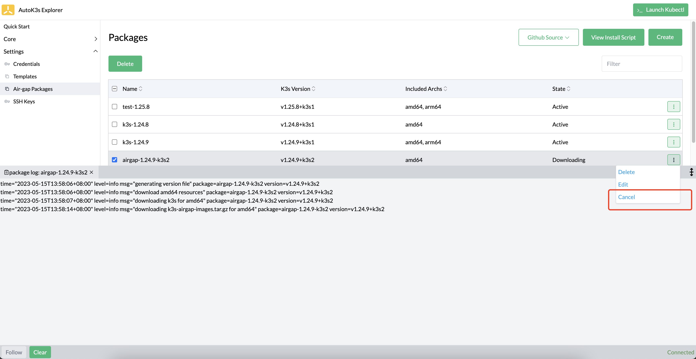
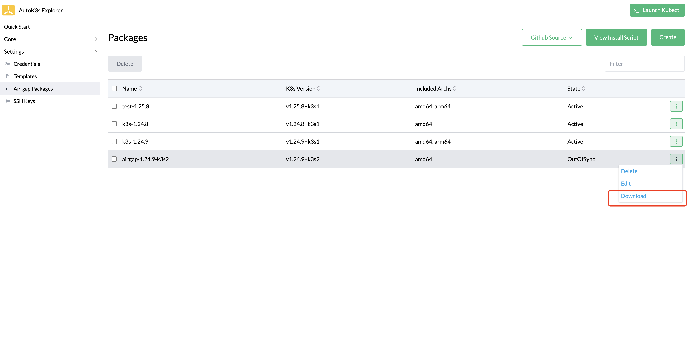
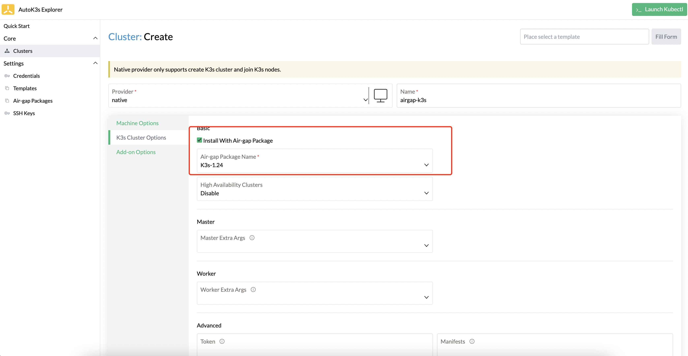
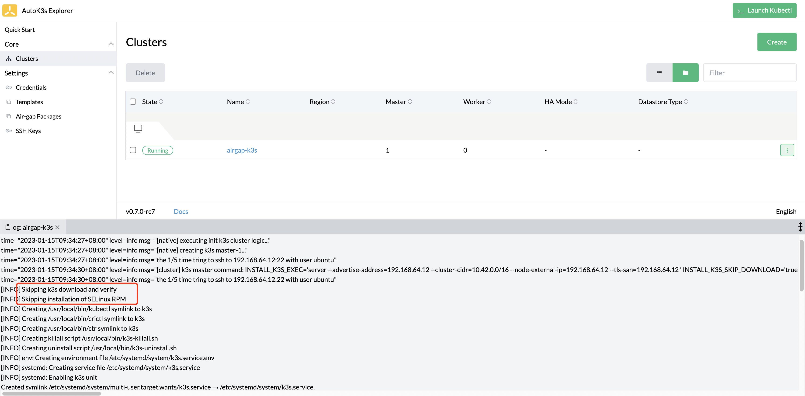

# 离线安装

## 概述

本文介绍 K3s 离线安装包管理以及使用离线安装方式部署集群。

## UI 使用说明

接下来我们基于 AutoK3s UI 介绍如何进行 K3s 离线安装包管理以及使用离线安装包部署 K3s 服务。如果您想了解 CLI 的使用，请移步到 [基础命令](#基础命令)

您可以通过[快速体验](../README.md#快速体验)中的描述，通过 Docker 或者 CLI 启动本地 UI，打开浏览器，访问目标端口 `8080` 即可。

### 离线包管理

在左侧菜单选择 `Settings` > `Air-gap Packages` 进入离线包管理页面，在页面中我们可以看到已经下载的 K3s 离线安装包。



#### 创建离线包

点击 `Create` 按钮可以创建一个新的 K3s 离线安装包。



**表 1：创建离线安装包参数**

| 参数                  | 说明                                   | 默认值
|:--------------------|:-------------------------------------| :-----------------
| Name                | 离线包名称                                |
| Import Package File | 导入离线安装包                              | `false`
| Package File        | 上传离线安装包，仅当勾选 Import Package File 时需要 |
| K3s Version         | 下载的 K3s 离线安装包版本                      |
| Included Archs      | 离线安装包的内核架构，可以同时选择多个架构                |

创建完成后，该离线安装包的状态为 `OutOfSync`，AutoK3s 会根据用户配置自行拉取安装包，并更新离线包状态，显示下载日志，方便用户跟踪下载进度。



下载完成后，安装包的状态会变成 `Active`，下载完成的安装包会保存在 `<config-path>/pakcage/<name>` 路径中。



#### 更新离线包

如果想更新离线安装包，点击右侧 `Edit` 按钮，即可修改安装包版本及内核架构。



#### 切换下载源

离线安装包默认使用 Github 源下载，如果访问 Github 源网络不好，可以从 UI 上切换到 `aliyunoss` 源进行离线包的下载。



#### 离线包下载及取消

如果使用的源下载速度过慢时，可以点击离线包右侧的下拉按钮，点击 `Cancel` 取消当前下载，切换下载源后重新尝试。



如果离线包下载失败，或取消了之前的下载，可以点击离线包右侧的下拉按钮，点击 `Download` 重新下载。



#### 使用离线包部署集群

这里我们以 `Native Provider` 为例，在本地虚拟机上使用这个离线安装包部署 K3s 集群，创建集群的参数这里就不进行赘述了，在 K3s Cluster Options 选项中，选中 Install With Air-gap Package 并选择指定的离线包。



点击创建按钮，等待集群部署完成，这里我们从日志可以看到已经跳过了下载验证步骤，直接使用离线包进行安装。



## 基础命令

新增子命令 `autok3s airgap`，用于管理 K3s 离线安装文件。以下是命令帮助详情：

```sh
Usage:
  autok3s airgap [command]

Available Commands:
  create                Create a new airgap package and will download related resources from internet.
  export                export package to a tar.gz file, path can be a specific filename or a directory.
  import                Import an existing tar.gz file of airgap package. Please refer to export command
  ls                    List all stored airgap packages.
  remove                Remove a stored airgap package.
  update                Update a stored package with new selected archs.
  update-install-script Will update the embed k3s install.sh script.

Flags:
  -h, --help   help for airgap

Global Flags:
  -d, --debug                          Enable log debug level
      --log-flush-frequency duration   Maximum number of seconds between log flushes (default 5s)

Global Environments:
  AUTOK3S_CONFIG  Path to the cfg file to use for CLI requests (default ~/.autok3s)
  AUTOK3S_RETRY   The number of retries waiting for the desired state (default 20)

Use "autok3s airgap [command] --help" for more information about a command.
```

### 创建离线安装包

使用命令 `autok3s airgap create <name>` 创建一个新的离线安装包，必输参数为 `arch` 以及 `k3s-version`。支持通过 CLI 交互的方式填写参数。  
K3s 版本(`k3s-version`)列表可以在 Github 中 K3s 的[Release](https://github.com/k3s-io/k3s/releases)列表中找到。针对内核架构选择，支持 `amd64`, `arm64`, `arm`, 以及 `s390x`。需要注意的是 `s390x` 架构只在比较新的 K3s 版本中支持；如果在某个 K3s 版本下选择了并不支持的内核架构，创建离线安装包时会给出错误提示。

当新的离线安装包被创建后，autok3s 会校验其合法性并开始从 K3s 二进制分发站点下载资源。 如果需要切换离线包下载源，可以参考[切换下载源](README.md#切换下载源)的描述。在未来的版本会支持在CLI中修改该配置。

下载的离线安装包资源会存放在 `<config-path>/pakcage/<name>` 路径中，以下为每个安装包的目录结构：

```sh
.
├── .done
├── amd64
│   ├── .done
│   ├── k3s
│   ├── k3s-airgap-images.tar.gz
│   ├── k3s-images.txt
│   └── sha256sum.txt
├── arm64
│   ├── .done
│   ├── k3s
│   ├── k3s-airgap-images.tar.gz
│   ├── k3s-images.txt
│   └── sha256sum.txt
└── version.json
```

每个支持的内核架构文件都会存放在单独的目录中，并会在安装 K3s 集群时通过 scp 复制到目标节点中。

在资源下载完成后，通过 `autok3s airgap ls` 可以看待每个离线安装包的状态，下载完成后会显示为 `Active` 状态。

```sh
    NAME     K3SVERSION      arches     STATE
  test      v1.23.9+k3s1  amd64,arm64  Active
  testtest  v1.23.9+k3s1  amd64,arm64  Active
```

### 更新离线安装包

通过命令 `autok3s airgap update <name> [flags]` 可以更新离线安装包，与创建时一样，支持修改 `arch` 以及 `k3s-version`。  
当你修改 K3s 版本或删除一个 已经下载的内核架构时，会提示确认。也可以通过添加参数 `-f, --force` 进行强制更新。

更新操作只对受影响的内核架构资源文件进行变更。当更新 K3s 版本时，则所有选择的内核架构对应的资源都会被删除并重新下载。

### 离线安装包导入导出

离线安装包可以通过命令 `autok3s airgap export <name> <path>` 进行导出。离线安装包名称 `name` 以及导出路径 `path` 是必须的。导出路径可以指定一个以 `tar.gz` 结尾的文件名，或指定一个目录 。当导出路径为目录时，导出的文件名则为 `name.tar.gz`。  
已经导出的离线安装包可以通过命令 `autok3s airgap import <path> [name]` 进行导入。也可以在创建集群时，指定该安装包进行离线安装。

### K3s安装脚本


根据[K3s官方文档](https://rancher.com/docs/k3s/latest/en/installation/airgap/#prerequisites)，安装脚本 `install.sh` 需要在离线安装前分发到待安装集群的节点上。  
在 autok3s 中，我们在CI流程中内置了从 `https://get.k3s.io` 下载的脚本并存储在 `install-script` 设置中。通过命令 `autok3s airgap update-install-script` 可以联网更新最新的安装脚本到本地数据库中。安装脚本来源地址配置在设置 `install-script-source-repo` 中。

### 使用离线安装包创建/升级集群

目前离线安装集群支持除 `k3d` 外所有的 `云提供商`。你可以从帮助信息 `./autok3s create -p native --help` 中看到以下参数：

```sh
...
      --package-name string              The airgap package name from managed package list
      --package-path string              The airgap package path. The "package-name" flag will be ignored if this flag is also provided
...
```

使用离线安装包进行安装/升级集群时，可以通过 `--package-name` 参数指定一个已经下载好的离线安装包名称，或使用 `--package-path` 指定一个已导出的离线安装文件。

当以上任意一个参数被使用的情况下，autok3s 会认为使用离线安装方式安装 K3s 集群，这些参数 `--k3s-channel`, `--k3s-install-mirror`, `--k3s-install-script` 以及 `--k3s-version` 将不会生效。并且显示的 K3s 版本为离线安装包对应的版本。

离线安装过程如下：

- 创建待安装 K3s 集群的节点，不需要则跳过
- ssh到节点上，通过 `uname -a` 确认节点的内核架构
- 确认该节点的内核架构是否在离线安装包中支持，不支持则报错退出
- 将资源 `install.sh`, `k3s` 以及 `k3s-image-list.tar` 通过 scp 远程复制到节点上
- 使用离线安装命令安装 K3s 集群

> 当前不支持在离线安装模式下使用 docker 容器运行时运行 K3s组件，该功能将会在未来版本中支持。