# Harvester Provider

> 仅支持在 v0.4.7 到 v0.6.1 版本使用 Harvester provider

## 概述

本文介绍了如何在 Harvester 中创建和初始化 K3s 集群，以及为已有的 K3s 集群添加节点的操作步骤。除此之外，本文还提供了在 Harvester 上运行 AutoK3s 的进阶操作指导，如配置私有镜像仓库和启用 UI 组件。

## 前置要求

你需要提前搭建好 Harvester 环境，并准备好可访问 Harvester 集群的 Kubeconfig 文件。

### 准备镜像与网络

在使用 Harvester provider 之前，你需要上传好可以创建容器化实例的 OS 镜像，关于上传镜像的方法，可以参考[这里](https://docs.harvesterhci.io/zh/v1.0/upload-image)。

目前，Harvester 支持两种类型的网络：

- 管理网络
- VLAN 网络

Harvester 使用 [canal](https://projectcalico.docs.tigera.io/getting-started/kubernetes/flannel/flannel) 作为默认管理网络。它是一个内置网络，可以直接从集群中使用。
默认情况下，虚拟机的管理网络 IP 只能在集群节点内访问，虚拟机重启后管理网络 IP 会改变。

如果你是在 Harvester 集群外部使用 AutoK3s，你不能使用默认的管理网络，请你准备好可访问到 Harvester VM的 [VLAN 网络](https://docs.harvesterhci.io/zh/v1.0/networking/harvester-network#vlan-%E7%BD%91%E7%BB%9C)，以便 AutoK3s 可以在 Harvester VM 中安装 K3s 集群。

## UI 使用说明

接下来我们将介绍基于 AutoK3s 本地 UI 如何使用 AutoK3s 工具，在 Harvester 上创建和管理 K3s 集群。如果你想了解 CLI 的使用，请移步到 [CLI 使用说明](#cli-使用说明)

你可以通过[快速体验](../README.md#快速体验)中的描述，通过 Docker 或者 CLI 启动本地 UI，打开浏览器，访问目标端口 `8080` 即可。

### 快速创建集群

你可以使用快速创建功能，在指定的云提供商服务中，快速启动一个K3s集群。

以下图为例，我们将在 Harvester 使用默认配置创建一个单节点的 K3s 集群，虚拟机会在 `default` 命名空间中创建。

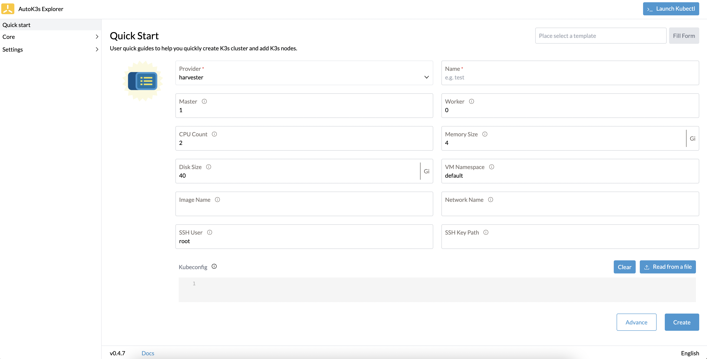

**表 1：快速创建参数**

| 参数           | 说明                                                         | 默认值
|:-------------|:-----------------------------------------------------------| :-----------------
| Provider     | 云提供商名称                                                     | `harvester`
| Name         | K3s集群名称                                                    |
| Master       | Master 节点数量                                                | `1`
| Worker       | Worker 节点数量                                                | `0`
| CPU Count    | 虚拟机CPU大小                                                   | `2`
| Memory Size  | 虚拟机内存大小                                                    | `4Gi`
| Disk Size    | 虚拟机磁盘大小                                                    | `40Gi`
| VM Namespace | 虚拟机所在命名空间                                                  | `default`
| Image Name   | 虚拟机镜像名称，如果与虚拟机所在命名空间不同，设置规则为 `<namespace>/<imageName>`     |
| Network Name | 虚拟机使用网络名称，如果与虚拟机所在命名空间不同，设置规则为 `<namespace>/<networkName>` |
| SSH User     | SSH 用户                                                     |
| SSH Key Path | 如果你选择了已有的密钥对，需要指定SSH 私钥目录，如果你使用AutoK3s 自动生成的密钥，这里可以不填写任何内容 |
| Kubeconfig   | 可操作 Harvester 集群的 Kubeconfig 文件内容                          |

### 自定义参数创建

如果你不想使用默认的配置，可以点击 **Advance** 按钮，进入自定义参数页面进行更多参数的设置。
或者你可以在集群列表页点击 **Create** 按钮进入自定义参数页面进行更多参数的设置。

使用 Harvester 云提供商创建 K3s 集群的自定义参数配置分为三项，实例配置、K3s集群配置、高级选项。接下来对每个配置项进行详细说明。

#### 实例配置

实例配置主要配置的内容为对应云提供商虚拟机的配置，例如实例运行命名空间、使用的操作系统类型、网络配置等信息。

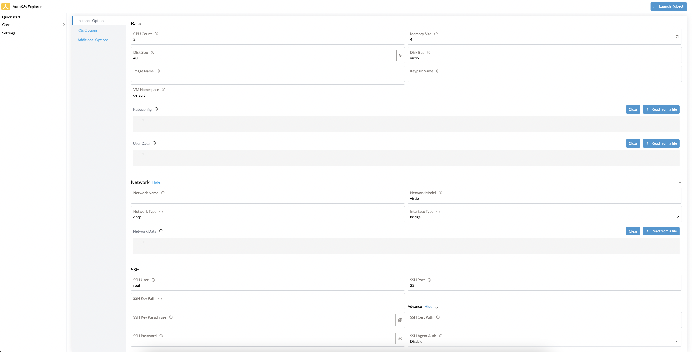

**表 3：实例配置参数**

| 参数                 | 说明                                                                                                      | 默认值
|:-------------------|:--------------------------------------------------------------------------------------------------------|:------------- 
| CPU Count          | 虚拟机CPU大小                                                                                                | `2`
| Memory Size        | 虚拟机内存大小                                                                                                 | `4Gi`
| Disk Size          | 虚拟机磁盘大小                                                                                                 | `40Gi`
| Disk Bus           | 磁盘类型，支持 `virtio`, `sata`, `scsi`                                                                        | `virtio`
| Image Name         | 虚拟机镜像名称，如果与虚拟机所在命名空间不同，设置规则为 `<namespace>/<imageName>`                                                  |
| Keypair Name       | 密钥对名称(如果你不设置密钥对，AutoK3s 将自动为你生成一个密钥对)                                                                   |
| VM Namespace       | 虚拟机所在命名空间                                                                                               | `default`
| Kubeconfig         | 可操作 Harvester 集群的 Kubeconfig 文件内容                                                                       |
| User Data          | Cloud init 模板内容                                                                                         |
| Network Name       | 虚拟机使用网络名称，如果与虚拟机所在命名空间不同，设置规则为 `<namespace>/<networkName>`                                              |
| Network Model      | 虚拟机使用的网卡驱动类型                                                                                            | `virtio`
| Network Type       | 网络类型，支持 `dhcp`, `pod`                                                                                   | `dhcp`
| Interface Type     | 网络接口类型，支持 `bridge`, `masquerade`                                                                        | `bridge`
| Network Data       | 自定义虚拟机网络配置，更多信息可参考[这里](https://cloudinit.readthedocs.io/en/latest/topics/network-config-format-v1.html) |
| SSH User           | SSH 用户                                                                                                  | `root`
| SSH Port           | SSH 端口                                                                                                  | `22`
| SSH Key Path       | 如果你选择了已有的密钥对，需要指定SSH 私钥目录，如果你使用AutoK3s 自动生成的密钥，这里可以不填写任何内容                                              |
| SSH Key Passphrase | 如果你的私钥需要密码验证，请在这里输入密码                                                                                   |
| SSH Password       | 如果你使用Password连接到虚拟机，请输入密码                                                                               |
| SSH Agent Auth     | 如果你配置 SSH 代理程序，可以开启此项配置                                                                                 | false
| SSH Cert Path      | 如果你配置了 ssh certificate，在这里你需要将 certificate path 传入进来，以保证 AutoK3s 可以通过ssh连接到远程虚拟机                        |

#### K3s 参数配置

K3s 参数配置项主要对 K3s 集群进行设置，例如是否部署 HA 模式、K3s 安装版本等。

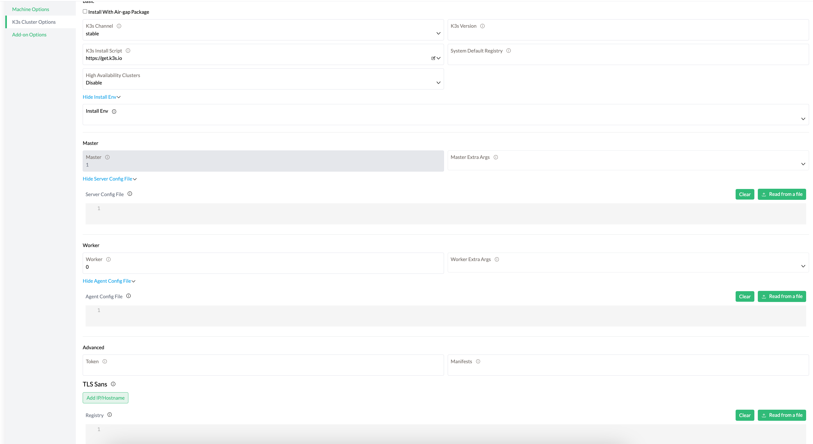

**表 4：K3s 配置参数**

| 参数                 | 说明 | 默认值
|:-------------------| :------------------ |:------------- 
| K3s Channel        | 用于获取 K3s 下载 URL 的通道。选项包括：`stable`, `latest`, `testing`。 | `stable`
| K3s Version        | 安装的 K3s 版本，如果设置则覆盖 Channel 选项 |
| Cluster            | 启用嵌入式 DB 高可用 K3s（即开启 `--cluster-init` 设置） | false
| Datastore          | 指定 etcd、Mysql、Postgres 或 Sqlite（默认）数据源名称 |
| K3s Install Script | K3s 安装脚本，对于中国区用户，可以通过下拉菜单选择 `rancher-mirror` 脚本来安装 | `https://get.k3s.io`
| Master             | Master 节点数量 |
| Master Extra Args  | Master 节点额外参数设置，例如 `--no-deploy traefik` |
| Worker             | Worker 节点数量 |
| Worker Extra Args  | Worker 节点额外参数设置，例如 `--node-taint key=value:NoExecute` |
| Token              | 用于将server或agent加入集群的共享secret，如果不设置，会自动生成一个Token |
| Manifests          | 自动部署应用清单目录，这里支持设置某个manifest文件或者包含多个manifest文件的目录路径（仅支持一层目录），具体功能可查看[这里](http://docs.rancher.cn/docs/k3s/advanced/_index/#%E8%87%AA%E5%8A%A8%E9%83%A8%E7%BD%B2%E6%B8%85%E5%8D%95) |
| TLS Sans           | 在 TLS 证书中添加其他主机名或 IP 作为主题备用名称，具体功能可查看[这里](https://docs.rancher.cn/docs/k3s/installation/install-options/server-config/_index#%E7%9B%91%E5%90%AC) |
| Registry           | [私有镜像仓库配置](https://docs.rancher.cn/docs/k3s/installation/private-registry/_index) |

#### 高级选项

配置要开启的 UI 组件（kubernetes-dashboard/kube-explorer）。

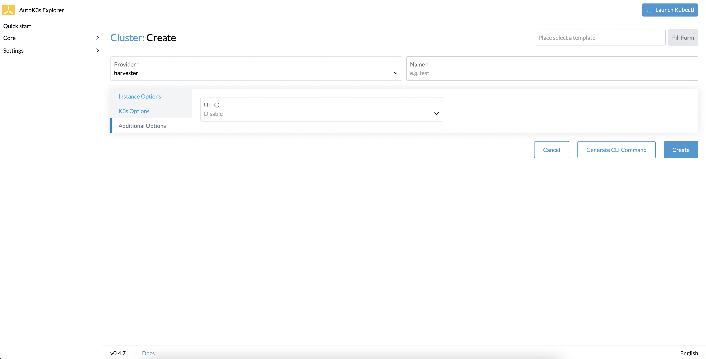

**表 4：高级选项**

| 参数   | 说明 | 默认值
|:-----| :------------------- |:------------- 
| UI   | 开启的 UI 组件（Kubernetes Dashboard/kube-explorer） |

### 集群模板

你可以使用模板功能，提前预置好常用的集群模板，每次创建集群时可以用模板参数进行填充，极大精简了重复操作。一次编写，多次运行，提升效率。

创建集群模板的参数与上面描述的自定义参数创建集群的表单内容相同，在这里不做赘述。

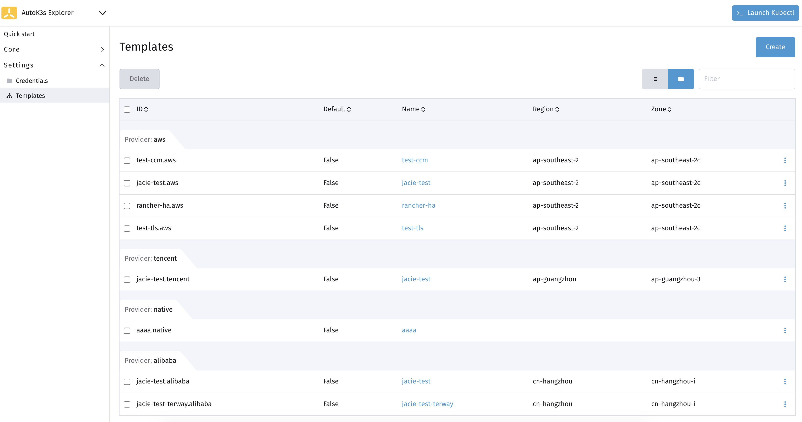

你可以选择最常用的模板，点击右侧下拉框中的 **Set Default** 按钮，将模板设置为默认模板。

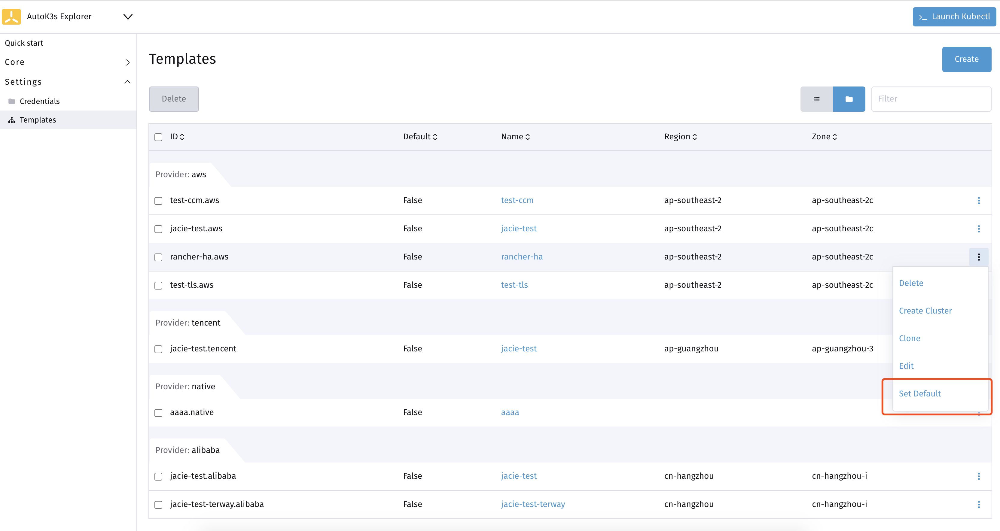

设置为默认模板后，你可以通过快速创建功能一键部署常用配置的 K3s 集群。

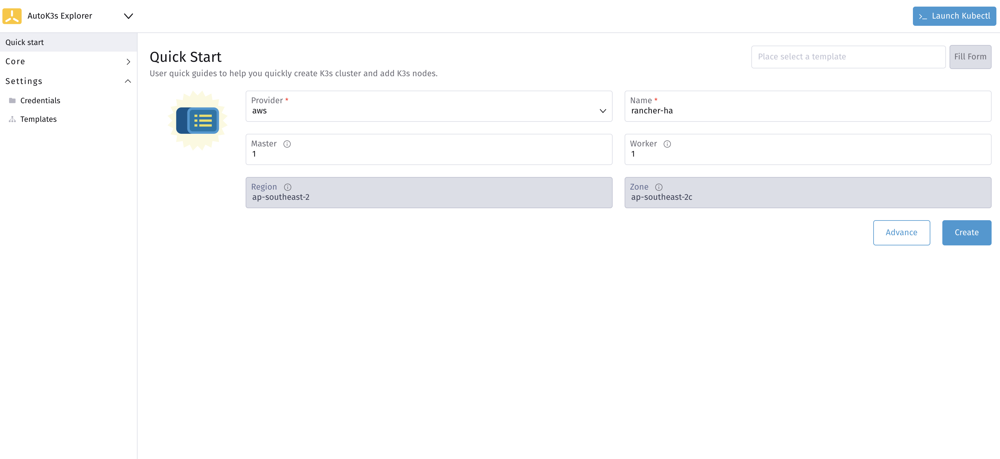

如果你想使用其他模板创建集群，你还可以在快速创建页面的右上角，或者在自定义创建集群的右上角筛选模板，点击 **Fill Form** 按钮后，会自动根据模板内容填充表单。

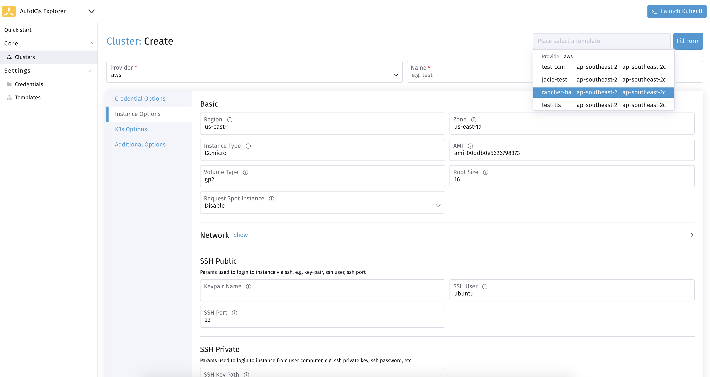

### 集群管理

你可以在集群列表页查看和管理使用 AutoK3s 创建的 K3s 集群。

#### 添加节点

选中你要添加节点的集群，点击右侧下拉菜单中的 **Join Node** 按钮，在弹出的窗口中设置要添加的节点数量即可。

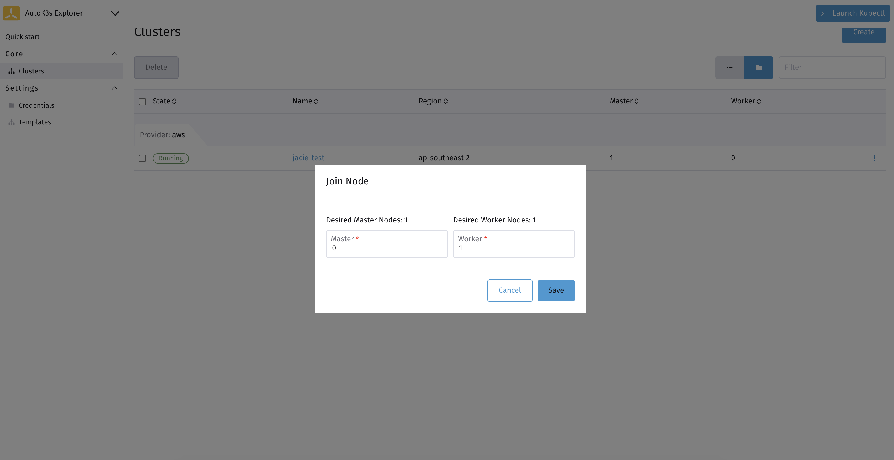

#### 集群升级

选中您要升级的集群，点击右侧下拉菜单中的 **Upgrade** 按钮，在弹出窗口中会显示您当前集群配置的版本信息，例如下图示例中，显示集群版本为 `v1.19.16+k3s1`。

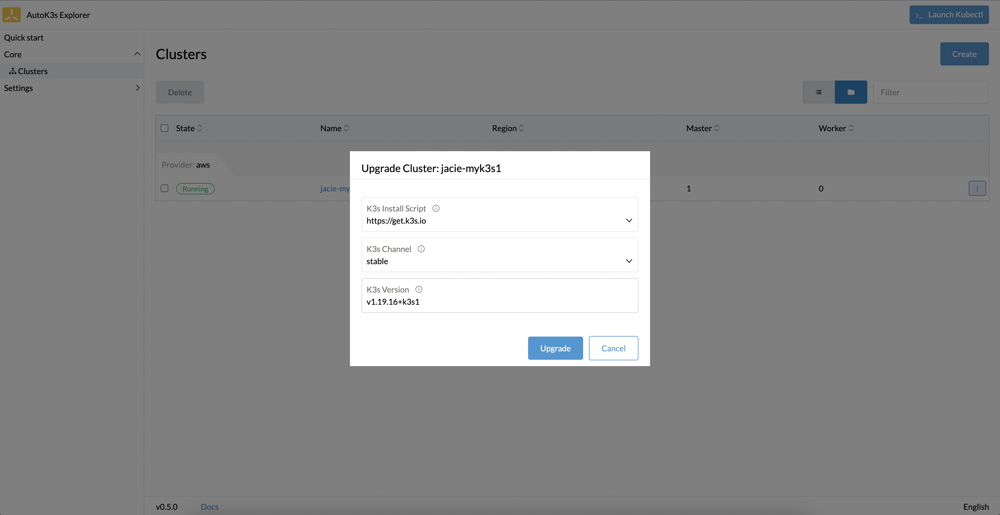

如果我们要将集群升级到 `v1.20.15+k3s1`，则修改 Version 为指定版本号即可；如果想要将集群升级到最新的stable版本，则删除掉 Version 指定的版本号。

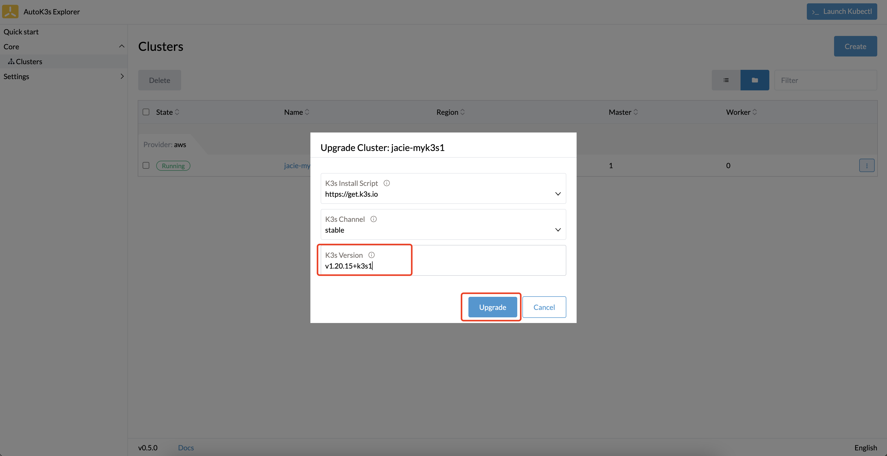

选择要升级的版本后，点击 **Upgrade** 按钮，等待集群升级完成。

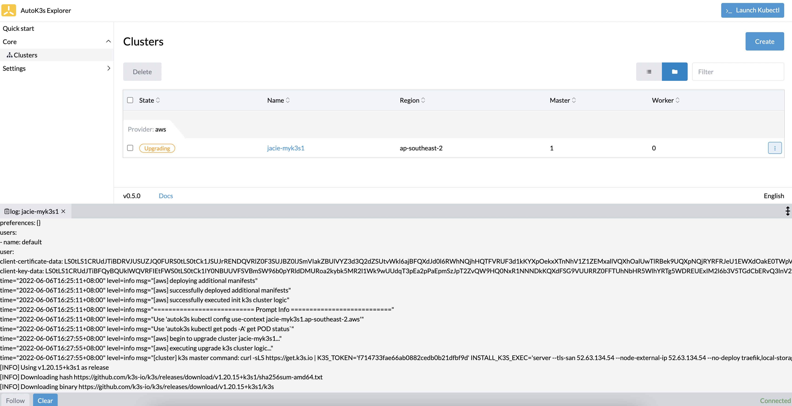

#### Kubectl

如果你想操作 K3s 集群数据，可以点击右上角 **Launch Kubectl** 按钮，在下拉框中选择要操作的集群后，便可以在 UI 控制台操作选中的集群了。

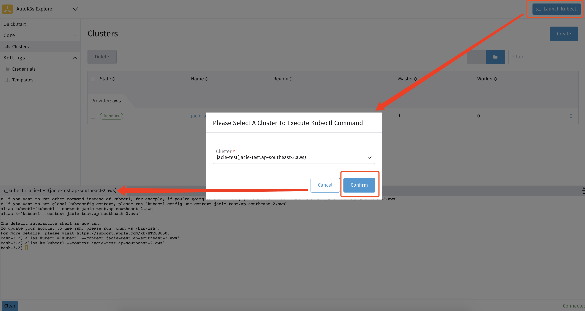

#### 下载 Kubeconfig 文件

如果您想在其他地方管理集群，可以单独下载指定集群的 Kubeconfig 文件。点击指定集群右侧下拉菜单中的 **Download KubeConfig** 按钮，在弹出窗口中选择复制或下载文件。

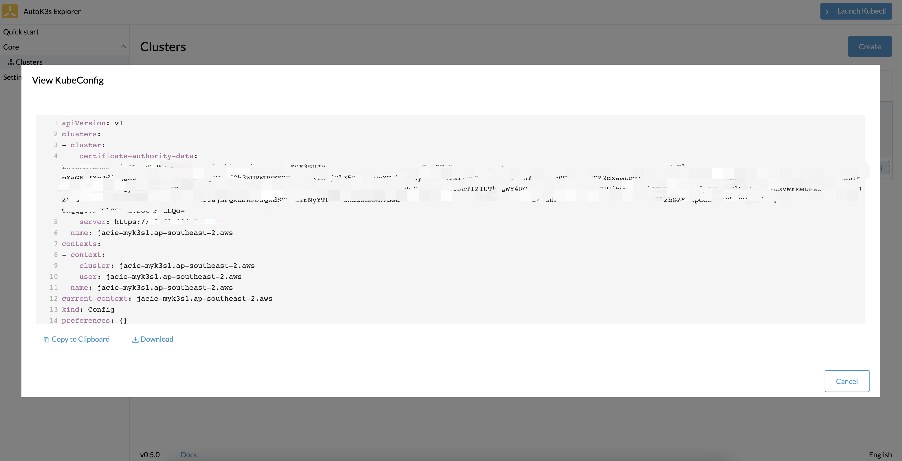

#### SSH

如果你想连接到远程主机进行操作，你可以在集群列表页面点击集群名称，进入详情页面，选择要连接的主机，点击右侧 **Execute Shell** 按钮。

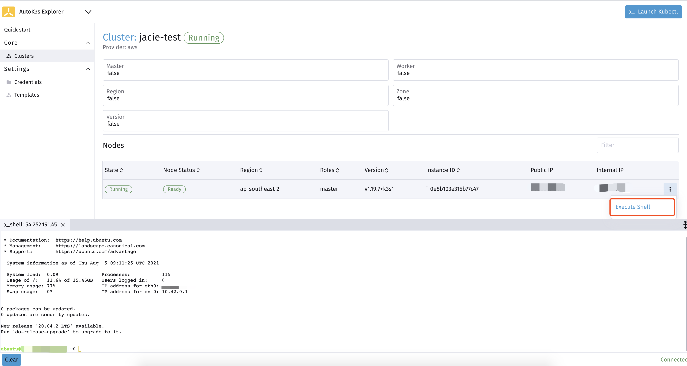

#### 开启 kube-explorer dashboard

你可以在创建集群时，通过 Additional Options 选择 explorer 选项开启 kube-explorer 功能。

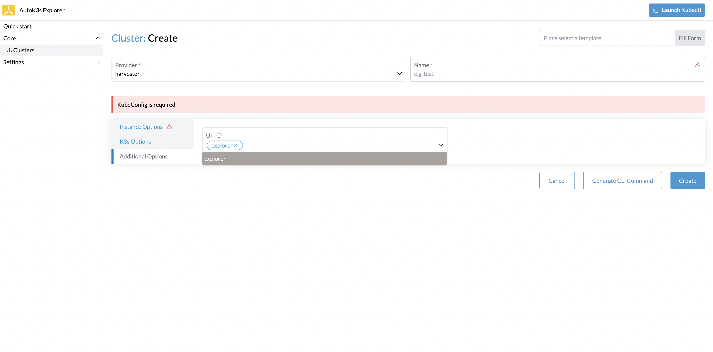

也可以通过右侧下拉菜单中选择 Enable Explorer 功能来开启 kube-explorer。

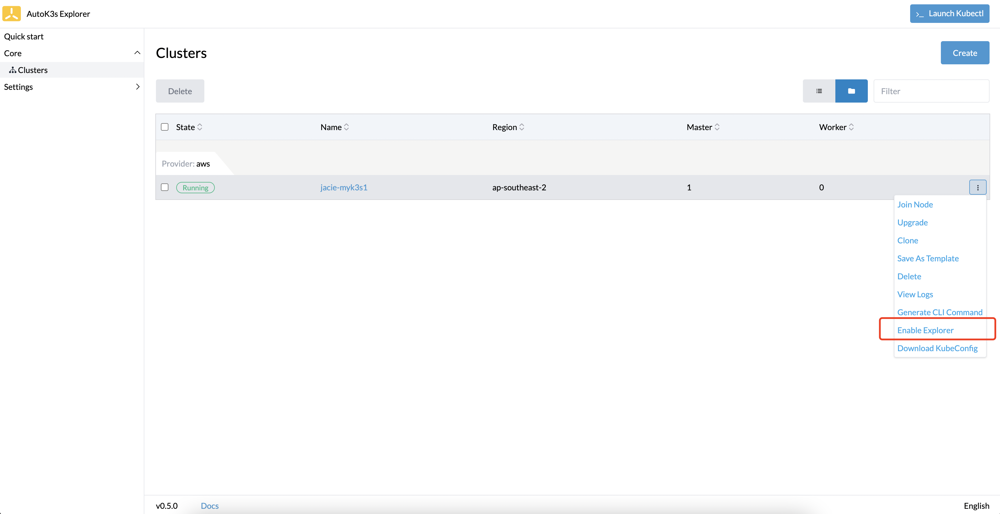

开启后，在集群列表会增加 dashboard 跳转链接按钮，点击跳转链接便可以访问 kube-explorer dashboard 页面了。

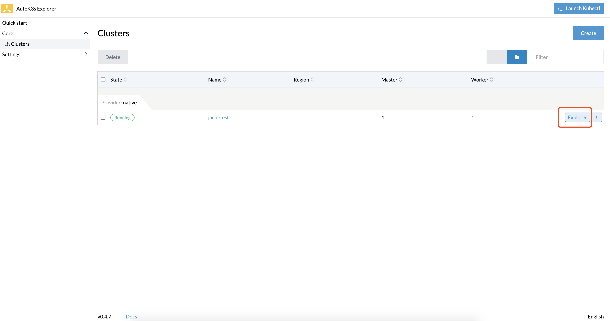

#### 关闭 kube-explorer dashboard

对于已经开启了 kube-explorer 功能的集群，可以在右侧下拉菜单中选择 Disable Explorer 功能来关闭 kube-explorer 服务。

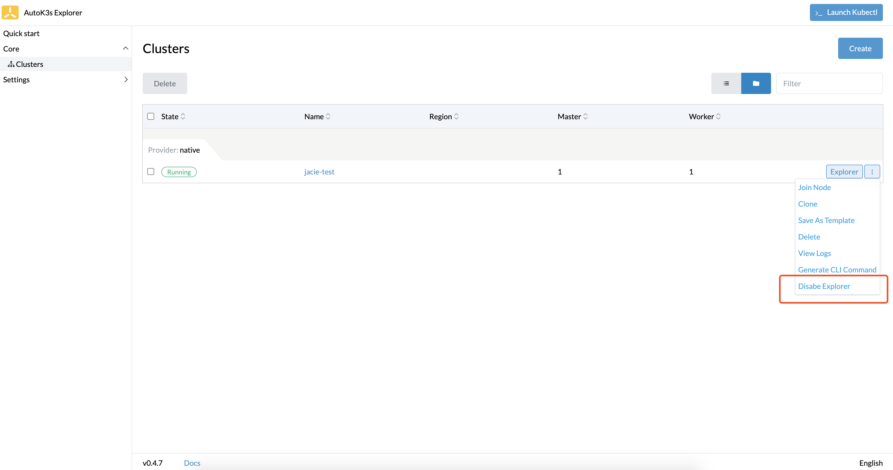

## CLI 使用说明

在使用命令之前，你需要设置环境变量。

```bash
export HARVESTER_KUBECONFIG_FILE='<your harvester kubeconfig file path>'
```

如想了解更多参数，请运行`autok3s <sub-command> --provider harvester --help`命令。

### 创建普通集群

运行以下命令，在 Harvester 上创建并启动创建一个名为 “myk3s”的集群，并为该集群配置 1 个 master 节点和 1 个 worker 节点。

```bash
autok3s -d create \
    --provider harvester \
    --name myk3s \
    --image-name <harvester image> \
    --network-name <vlan network name> \
    --master 1 \
    --worker 1
```

### 创建高可用 K3s 集群

创建高可用集群的命令分为两种，取决于你选择使用的是内置的 etcd 还是外部数据库。

#### 嵌入式 etcd（k3s 版本 >= 1.19.1-k3s1)

运行以下命令，在 Harvester 上创建并启动创建了一个名为“myk3s”，包含 3 个 master 节点的高可用 K3s 集群。

```bash
autok3s -d create \
    --provider harvester \
    --name myk3s \
    --image-name <harvester image> \
    --network-name <vlan network name> \
    --master 3 \
    --cluster
```

#### 外部数据库

在高可用模式下使用外部数据库，需要满足两个条件：

- master 节点的数量不小于 1。
- 需要提供外部数据库的存储路径。

所以在以下的代码示例中，我们通过`--master 2`指定 master 节点数量为 2，满足 master 节点的数量不小于 1 这个条件；且通过`--datastore "PATH"`指定外部数据库的存储路径，提供外部数据库的存储路径。

运行以下命令，在 Harvester 上创建并启动创建了一个名为“myk3s”，包含 2 个master 节点的高可用 K3s 集群：

```bash
autok3s -d create \
    --provider harvester \
    --name myk3s \
    --image-name <harvester image> \
    --network-name <vlan network name> \
    --master 2 \
    --datastore "mysql://<user>:<password>@tcp(<ip>:<port>)/<db>"
```

### 添加 K3s 节点

请使用`autok3s join`命令为已有集群添加 K3s 节点。

#### 普通集群

运行以下命令，为“myk3s”集群添加 1 个 worker 节点。

```bash
autok3s -d join --provider harvester --name myk3s --worker 1
```

#### 高可用 K3s 集群

```bash
autok3s -d join --provider harvester --name myk3s --master 2 --worker 1
```

### 删除 K3s 集群

删除一个 k3s 集群，这里删除的集群为 myk3s。

```bash
autok3s -d delete --provider harvester --name myk3s
```

### 查看集群列表

显示当前主机上管理的所有 K3s 集群列表。

```bash
autok3s list
```

```bash
  NAME   REGION  PROVIDER   STATUS   MASTERS  WORKERS    VERSION
  myk3s          harvester  Running  1        0        v1.22.6+k3s1
```

### 查看集群详细信息

显示具体的 K3s 信息，包括实例状态、主机 ip、集群版本等信息。

```bash
autok3s describe -n <clusterName> -p harvester
```

> 注意：如果使用不同的 provider 创建的集群名称相同，describe 时会显示多个集群信息，可以使用`-p <provider>`对 provider 进一步过滤。例如：`autok3s describe -n myk3s -p harvester`。

```bash
Name: myk3s
Provider: harvester
Region:
Zone:
Master: 1
Worker: 2
Status: Running
Version: v1.22.6+k3s1
Nodes:
  - internal-ip: [x.x.x.x]
    external-ip: [x.x.x.x]
    instance-status: Running
    instance-id: autok3s-myk3s-76mfl
    roles: <none>
    status: Ready
    hostname: autok3s-myk3s-76mfl
    container-runtime: containerd://1.5.9-k3s1
    version: v1.22.6+k3s1
```

### Kubectl

群创建完成后, `autok3s` 会自动合并 `kubeconfig` 文件。

```bash
autok3s kubectl config use-context myk3s.myns.harvester
autok3s kubectl <sub-commands> <flags>
```

在多个集群的场景下，可以通过切换上下文来完成对不同集群的访问。

```bash
autok3s kubectl config get-contexts
autok3s kubectl config use-context <context>
```

### SSH

SSH 连接到集群中的某个主机，这里选择的集群为 myk3s。

```bash
autok3s ssh --provider harvester --name myk3s
```

### 升级 K3s 集群

您可以使用以下命令将指定的 K3s 集群升级到 `latest` 版本

```bash
autok3s upgrade --provider harvester --name myk3s --k3s-channel latest
```

如果您想将 K3s 集群升级到指定版本，可以指定 `--k3s-version`

```bash
autok3s upgrade --provider harvester --name myk3s --k3s-version v1.22.4+k3s1
```

### 进阶使用

AutoK3s 集成了一些与当前 provider 有关的高级组件，例如私有镜像仓库 和 UI。

#### 配置私有镜像仓库

在运行`autok3s create`或`autok3s join`时，通过传递`--registry /etc/autok3s/registries.yaml`以使用私有镜像仓库，例如：

```bash
autok3s -d create \
    --provider harvester \
    --name myk3s \
    --image-name <harvester image> \
    --network-name <vlan network name> \
    --master 1 \
    --worker 1 \
    --registry /etc/autok3s/registries.yaml
```

使用私有镜像仓库的配置请参考以下内容，如果你的私有镜像仓库需要 TLS 认证，`autok3s`会从本地读取相关的 TLS 文件并自动上传到远程服务器中完成配置，你只需要完善`registry.yaml`即可。

```bash
mirrors:
  docker.io:
    endpoint:
      - "https://mycustomreg.com:5000"
configs:
  "mycustomreg:5000":
    auth:
      username: xxxxxx # this is the registry username
      password: xxxxxx # this is the registry password
    tls:
      cert_file: # path to the cert file used in the registry
      key_file:  # path to the key file used in the registry
      ca_file:   # path to the ca file used in the registry
```

#### 启用 UI 组件

可以通过 AutoK3s 开启 [kube-explorer](https://github.com/cnrancher/kube-explorer) 对 K3s 集群进行管理。

```bash
autok3s explorer --context <context> --port 9999
```
您可以通过 http://127.0.0.1:9999 访问 kube-explorer dashboard 页面。
