# K3d Provider

## 概述

本文介绍了如何使用 K3d 在宿主机中使用 Docker 初始化 K3s 集群，以及为已有的 K3s 集群添加节点的操作步骤。除此之外，本文还提供了在 K3d 上运行 AutoK3s 的进阶操作指导，如配置私有镜像仓库。

## 前置要求

- 强烈建议您在 Linux/Unix 环境中使用 K3d Provider
- 安装 [Docker](https://docs.docker.com/get-docker/)

## UI 使用说明

接下来我们将基于 AutoK3s 本地 UI 介绍如何使用 AutoK3s 工具，在 Docker 中启动 K3s 集群。如果您想了解 CLI 的使用，请移步到 [CLI 使用说明](#CLI 使用说明)

您可以通过[快速体验](../README.md#快速体验)中的描述，通过 Docker 或者 CLI 启动本地 UI，打开浏览器，访问目标端口 `8080` 即可。

> 请注意：
- 如果您使用 Docker 启动 AutoK3s 服务并且需要使用 K3d Provider，请将 docker.sock 文件挂载到容器中。
- 受限于 MacOS docker vm，k3d 本身在 MacOS 下使用存在限制，为了您更好的体验，建议在 Linux 下使用 k3d provider。
- 如确实需要 MacOS 下使用，需注意 MacOS 下 Docker 不支持 Host Networking，请使用 publish 端口方式。此时，AutoK3s 无法使用 Kubectl shell 操作 K3d 集群，请转而进入 K3d 集群的 node shell，依托 master 节点自带的kubectl进行管理。参考：https://docs.docker.com/network/host/

### 快速创建集群

您可以使用快速创建功能，在指定的云提供商服务中，快速启动一个K3s集群。

以下图为例，我们将在 Docker 中使用默认配置创建一个单节点的 K3s 集群。

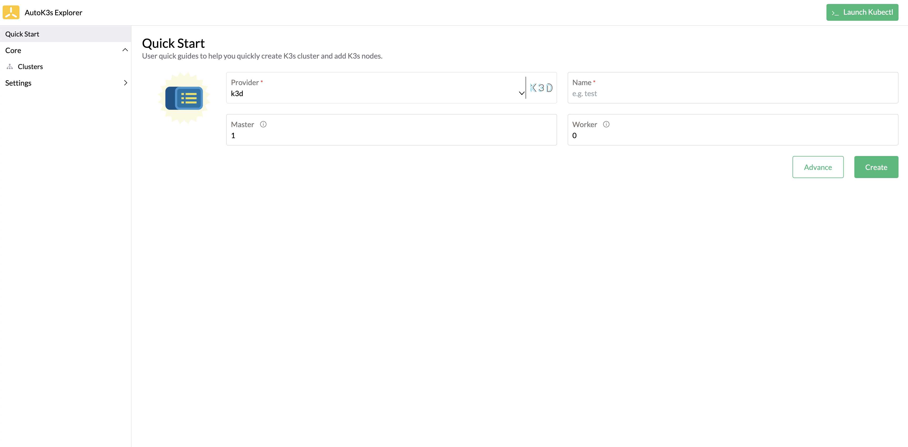

**表 1：快速创建参数**

| 参数        | 说明 | 默认值
|:----------| :----------------- | :-----------------
| Provider  | 云提供商名称 | `k3d`
| Name      | K3s集群名称 |
| Master    | Master 节点数量 | `1`
| Worker    | Worker 节点数量 | `0`

### 自定义参数创建

如果您不想使用默认的配置，可以点击 **Advance** 按钮，进入自定义参数页面进行更多参数的设置。
或者您可以在集群列表页点击 **Create** 按钮进入自定义参数页面进行更多参数的设置。

使用 K3d 云提供商创建 K3s 集群的自定义参数配置仅有一项，接下来对每个配置项进行详细说明。

#### K3d 配置

K3d 配置主要配置的内容为启动 K3s 集群所需的参数，例如 K3s 镜像、容器运行内存、环境变量、挂载数据卷等信息。

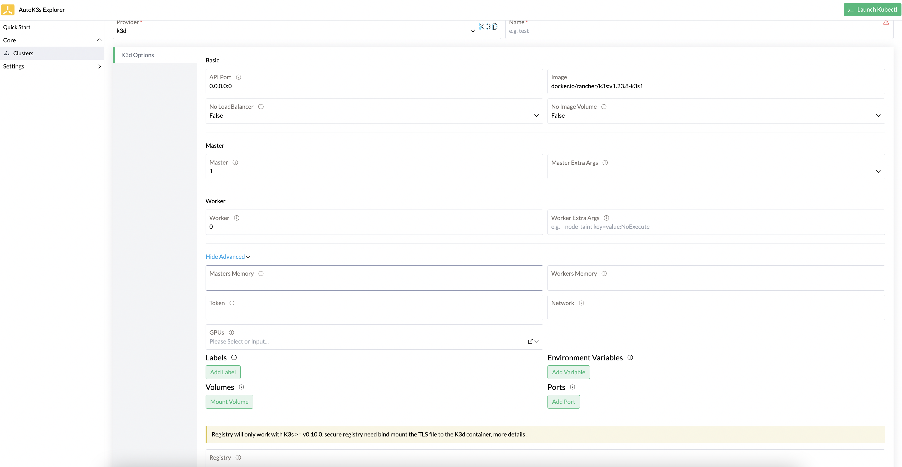

**表 2：实例配置参数**

| 参数                    | 说明                                                                                             | 默认值
|:----------------------|:-----------------------------------------------------------------------------------------------|:------------- 
| API Port              | 指定在LoadBalancer上公开的 Kubernetes API 服务器端口，例如（--api-port 0.0.0.0:6550）                           | `0.0.0.0:0`
| Image                 | 在 Docker 中启动的 K3s 镜像                                                                           | `docker.io/rancher/k3s:v1.23.8-k3s1`
| No LoadBalancer       | 禁用 LoadBalancer                                                                                | `false`
| No Image Volume       | 禁用创建用于导入镜像的数据卷                                                                                 | `false`
| Master                | Master 节点数量                                                                                    |
| Master Extra Args     | Master 节点额外参数设置，例如 `--no-deploy traefik`                                                       |
| Worker                | Worker 节点数量                                                                                    |
| Worker Extra Args     | Worker 节点额外参数设置，例如 `--node-taint key=value:NoExecute`                                          |
| Masters Memory        | Master 节点内存限制[作用于Docker]                                                                       |
| Workers Memory        | Worker 节点内存限制[作用于Docker]                                                                       |
| Token                 | 用于将server或agent加入集群的共享secret，如果不设置，会自动生成一个Token                                                |
| Network               | 使用已经存在的 [Docker 网络](https://k3d.io/v5.2.2/design/networking/)                                  |
| GPUs                  | 将GPU设备添加到群集节点容器（设置`all`将添加所有GPU到容器）[作用于Docker]                                                 |
| Labels                | 将标签添加到节点容器，例如`--labels my.label@agent [0,1] --labels other.label=somevalue@server:0`           |
| Environment Variables | 将环境变量添加到节点，例如`--envs HTTP_PROXY=my.proxy.com@server:0 --envs SOME_KEY=SOME_VAL@server:0`       |
| Volumes               | 将卷挂载到节点中，例如`--volumes /my/path@agent:0,1 --volumes /tmp/test:/tmp/other@server:0`              |
| Ports                 | 将节点容器中的端口映射到主机，例如`--ports 8080:80@agent:0 --ports 8081@agent:1`                                |
| Registry              | 私有镜像仓库配置文件路径，如果您的私有镜像仓库带有证书，请参考[这里](https://k3d.io/v5.2.2/usage/registries/#secure-registries) |


### 集群模板

您可以使用模板功能，提前预置好常用的集群模板，每次创建集群时可以用模板参数进行填充，极大精简了重复操作。一次编写，多次运行，提升效率。

创建集群模板的参数与上面描述的自定义参数创建集群的表单内容相同，在这里不做赘述。

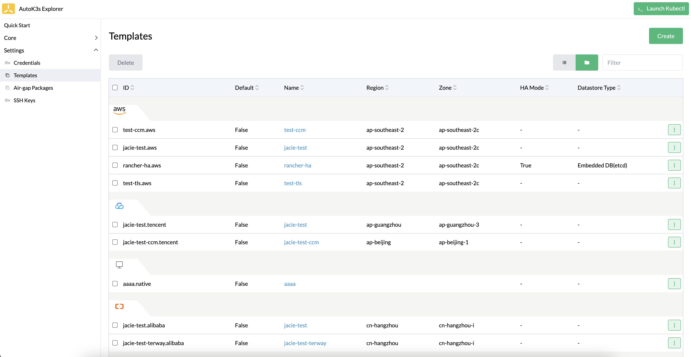

您可以选择最常用的模板，点击右侧下拉框中的 **Set Default** 按钮，将模板设置为默认模板。

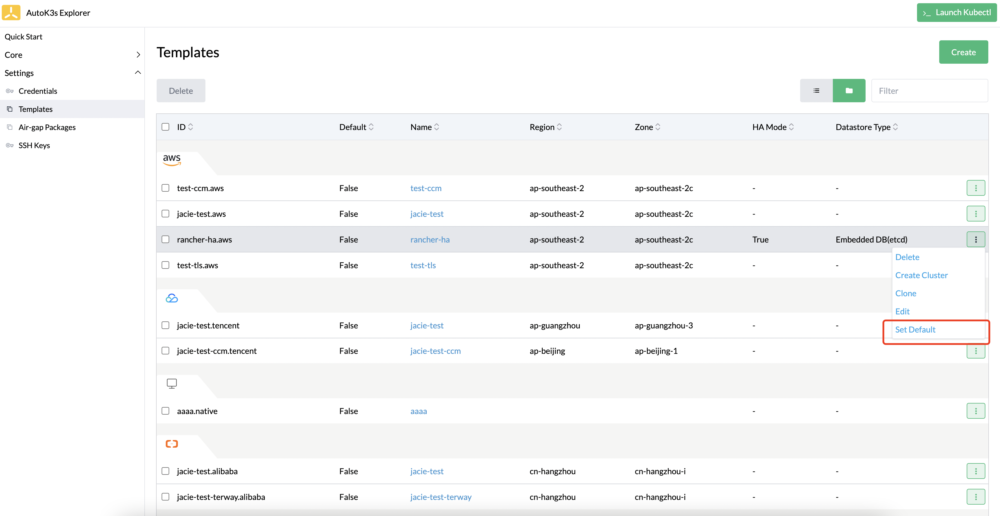

设置为默认模板后，您可以通过快速创建功能一键部署常用配置的 K3s 集群。

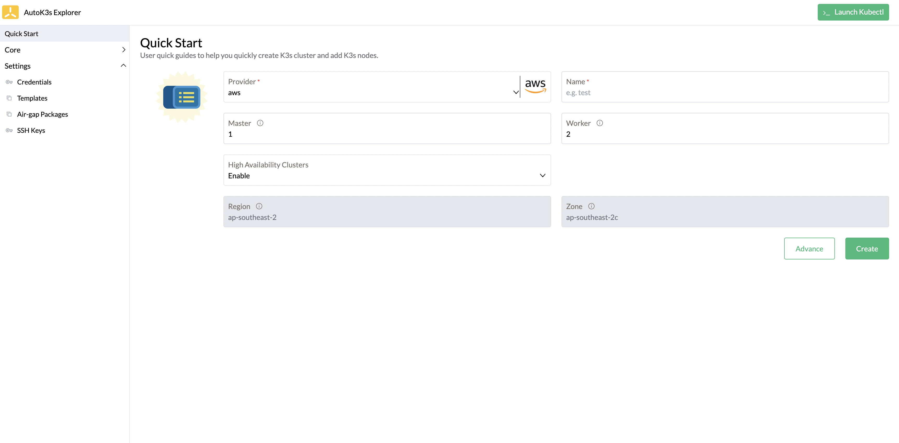

如果您想使用其他模板创建集群，您还可以在快速创建页面的右上角，或者在自定义创建集群的右上角筛选模板，点击 **Fill Form** 按钮后，会自动根据模板内容填充表单。

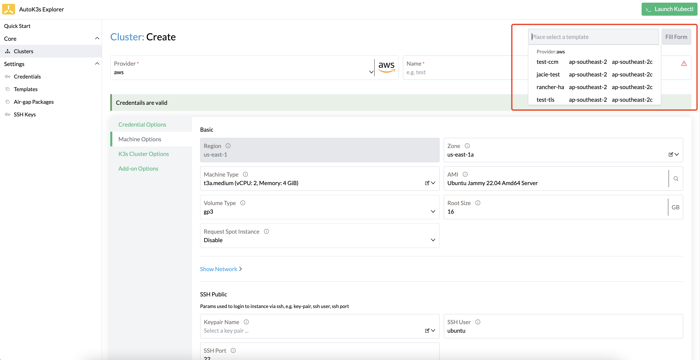

### 集群管理

您可以在集群列表页查看和管理使用 AutoK3s 创建的 K3s 集群。

#### 添加节点

选中您要添加节点的集群，点击右侧下拉菜单中的 **Join Node** 按钮，在弹出的窗口中设置要添加的节点数量即可。

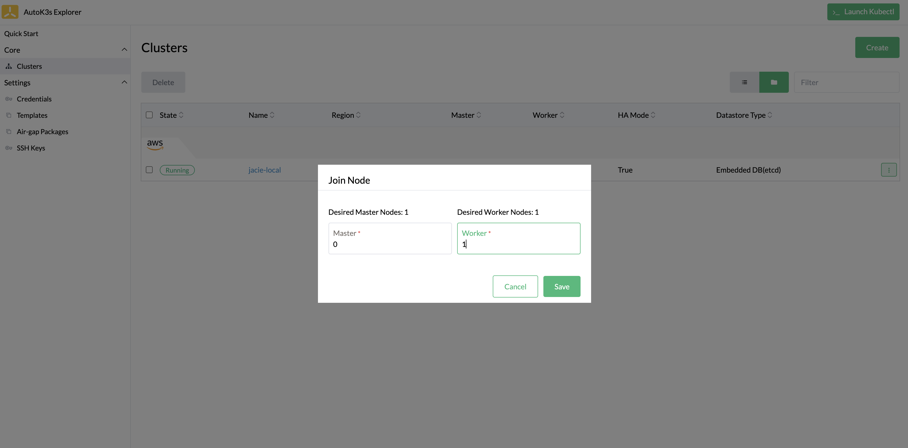

#### Kubectl

如果您想操作 K3s 集群数据，可以点击右上角 **Launch Kubectl** 按钮，在下拉框中选择要操作的集群后，便可以在 UI 控制台操作选中的集群了。

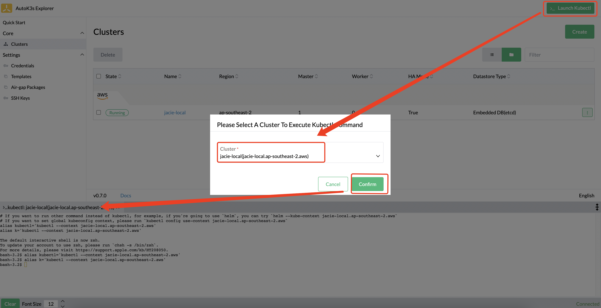

#### 下载 Kubeconfig 文件

如果您想在其他地方管理集群，可以单独下载指定集群的 Kubeconfig 文件。点击指定集群右侧下拉菜单中的 **Download KubeConfig** 按钮，在弹出窗口中选择复制或下载文件。

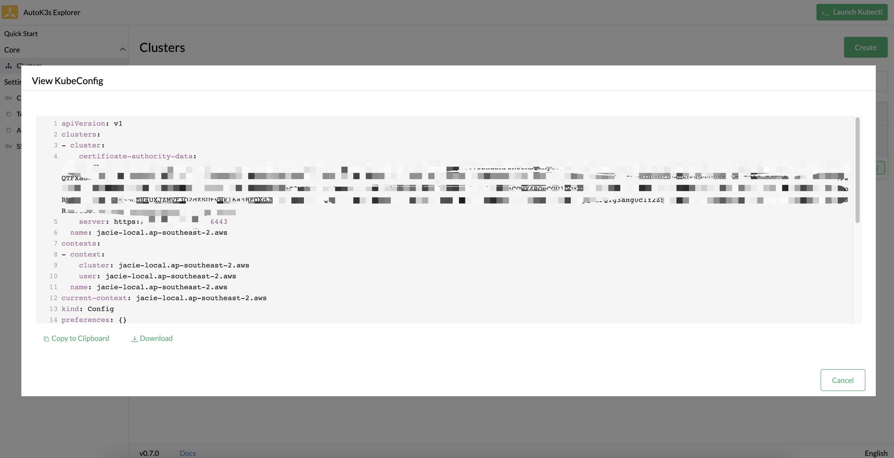

#### SSH

如果您想连接到远程主机进行操作，您可以在集群列表页面点击集群名称，进入详情页面，选择要连接的主机，点击右侧 **Execute Shell** 按钮。

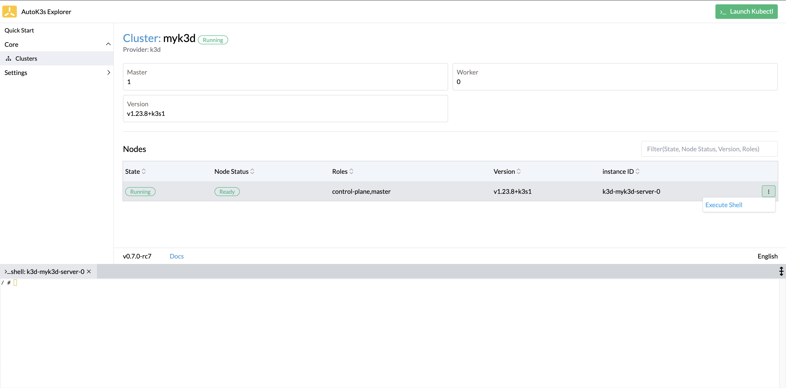

#### 开启 kube-explorer dashboard

您可以通过右侧下拉菜单中选择 Enable Explorer 功能来开启 kube-explorer。

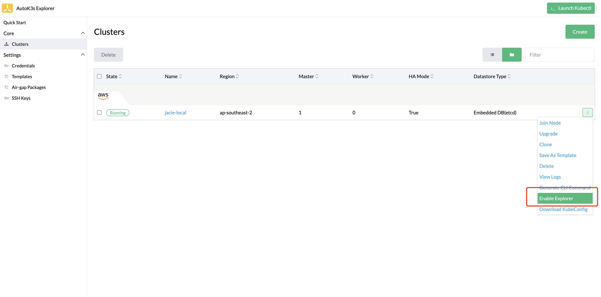

开启后，在集群列表会增加 Explorer 跳转链接按钮，点击跳转链接便可以访问 kube-explorer dashboard 页面了。

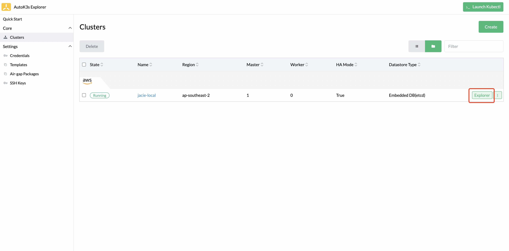

#### 关闭 kube-explorer dashboard

对于已经开启了 kube-explorer 功能的集群，可以在右侧下拉菜单中选择 Disable Explorer 功能来关闭 kube-explorer 服务。

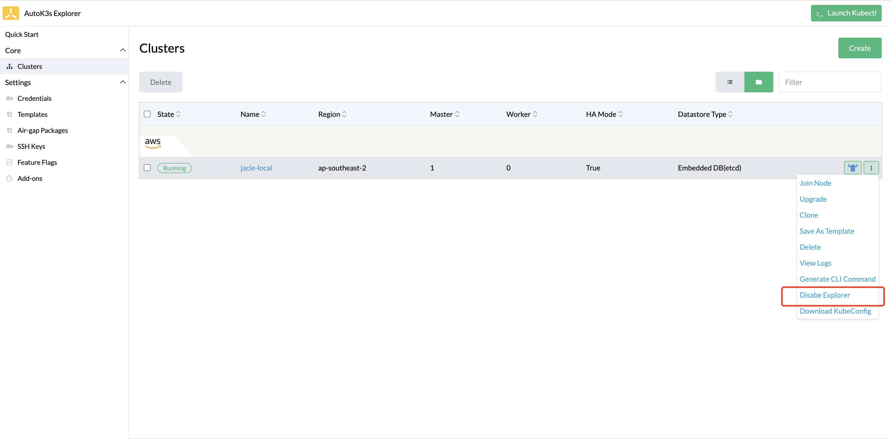

> 请注意：
> - MacOS 下 Docker 不支持 Host Networking，如果在 MacOS 下使用 K3d provider，由于无法使用 Kubectl shell 功能操作 K3d 集群，所以我们无法使用 kube-explorer 功能。

#### 开启 helm-dashboard

可以在 Settings > Feature Flags 选择 helm-dashboard 选项来开启 helm-dashboard 功能。

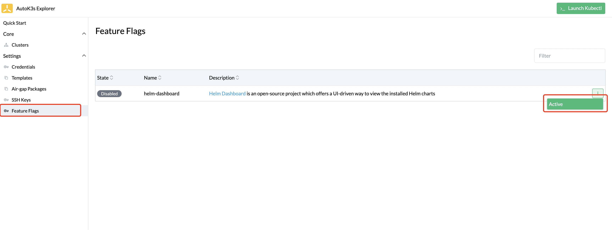

开启后，在集群列表会增加 Dashboard 跳转链接按钮，点击跳转链接便可以访问 helm-dashboard 页面了。

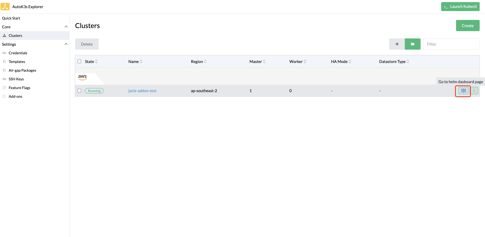

#### 关闭 helm-dashboard

可以在 Settings > Feature Flags 将已经开启的 helm-dashboard 关闭。


## CLI 使用说明

如想了解更多参数，请运行`autok3s <sub-command> --provider k3d --help`命令。

### 创建普通集群

运行以下命令，将在宿主机使用 Docker 启动名称为“myk3s”的集群，并为该集群配置 1 个 master 节点和 1 个 worker 节点。

```bash
autok3s -d create -p k3d -n myk3s --master 1 --worker 1
```

### 创建高可用 K3s 集群

#### 嵌入式 etcd

运行以下命令，将在宿主机中使用 Docker 启动一个名为“myk3s”，包含 3 个 master 节点的高可用 K3s 集群。

```bash
autok3s -d create -p k3d -n myk3s --master 3
```

### 添加 K3s 节点

请使用`autok3s join`命令为已有集群添加 K3s 节点。

#### 普通集群

运行以下命令，为“myk3s”集群添加 1 个 worker 节点。

```bash
autok3s -d join -p k3d -n myk3s --worker 1
```

#### 高可用 K3s 集群

```bash
autok3s -d join -p k3d -n myk3s --master 1 --worker 1
```

### 删除 K3s 集群

删除一个 k3s 集群，这里删除的集群为 myk3s。

```bash
autok3s -d delete -p k3d -n myk3s
```

### 查看集群列表

显示当前主机上管理的所有 K3s 集群列表。

```bash
autok3s list
```

```bash
NAME   REGION  PROVIDER  STATUS   MASTERS  WORKERS    VERSION     
myk3s          k3d       Running  1        1        v1.20.5+k3s1 
```

### 查看集群详细信息

显示具体的 K3s 信息，包括实例状态、主机 ip、集群版本等信息。

```bash
autok3s describe -n myk3s -p k3d
```

> 注意：如果使用不同的 provider 创建的集群名称相同，describe 时会显示多个集群信息，可以使用`-p <provider>`对 provider 进一步过滤。例如：`autok3s describe -n myk3s -p k3d`。

```bash
Name: myk3s
Provider: k3d
Region: 
Zone: 
Master: 1
Worker: 1
Status: Running
Version: v1.20.5+k3s1
Nodes:
  - internal-ip: []
    external-ip: []
    instance-status: running
    instance-id: k3d-myk3s-agent-0
    roles: <none>
    status: Ready
    hostname: k3d-myk3s-agent-0
    container-runtime: containerd://1.4.4-k3s1
    version: v1.20.5+k3s1
  - internal-ip: []
    external-ip: []
    instance-status: running
    instance-id: k3d-myk3s-server-0
    roles: control-plane,master
    status: Ready
    hostname: k3d-myk3s-server-0
    container-runtime: containerd://1.4.4-k3s1
    version: v1.20.5+k3s1
```

### Kubectl

群创建完成后, `autok3s` 会自动合并 `kubeconfig` 文件。

```bash
autok3s kubectl config use-context k3d-myk3s
autok3s kubectl <sub-commands> <flags>
```

在多个集群的场景下，可以通过切换上下文来完成对不同集群的访问。

```bash
autok3s kubectl config get-contexts
autok3s kubectl config use-context <context>
```

### SSH

SSH 连接到集群中的某个主机，这里选择的集群为 myk3s。

```bash
autok3s ssh -p k3d -n myk3s
```

### 进阶使用

AutoK3s 集成了一些与当前 provider 有关的高级组件，例如私有镜像仓库。

#### 配置私有镜像仓库

私有镜像仓库配置仅作用于 k3s v0.10.0 及以上版本，带认证的私有镜像仓库需要将 TLS 文件挂载到 K3d 容器中，更多的信息请查看[这里](https://k3d.io/v5.2.2/usage/registries/#secure-registries)。

使用私有镜像仓库的配置请参考以下内容，如果您的私有镜像仓库需要 TLS 认证，`autok3s`会从本地读取相关的 TLS 文件并自动上传到远程服务器中完成配置，您只需要完善`registry.yaml`即可。

```bash
mirrors:
  my.company.registry:
    endpoint:
      - https://my.company.registry

configs:
  my.company.registry:
    tls:
      # we will mount "my-company-root.pem" in the /etc/ssl/certs/ directory.
      ca_file: "/etc/ssl/certs/my-company-root.pem"
```

在运行 `autok3s create` 或 `autok3s join` 时，通过传递 `--registry /etc/autok3s/registries.yaml` 以使用私有镜像仓库，例如：

```bash
autok3s -d create \
    --provider k3d \
    --name myk3s \
    --master 1 \
    --worker 1 \
    --registry /etc/autok3s/registries.yaml
    --volumes ${HOME}/.k3d/my-company-root.pem:/etc/ssl/certs/my-company-root.pem
```

## 常见问题

### 使用 K3d provider 设置内存后创建集群失败

如果你使用 Docker 运行 AutoK3s，并且使用 K3d provider 创建集群时设置了内存，并且集群创建失败，出现如下类型的错误日志：
```
time="2023-05-25T02:54:23Z" level=error msg="[k3d] cluster mem-test run failed: Failed Cluster Start: Failed to start server k3d-mem-test-server-0: runtime failed to start node 'k3d-mem-test-server-0': docker failed to start container for node 'k3d-mem-test-server-0': Error response from daemon: failed to create shim task: OCI runtime create failed: runc create failed: unable to start container process: error during container init: error mounting \"/root/.k3d/.k3d-mem-test-server-0/meminfo\" to rootfs at \"/proc/meminfo\": mount /root/.k3d/.k3d-mem-test-server-0/meminfo:/proc/meminfo (via /proc/self/fd/6), flags: 0x5001: not a directory: unknown: Are you trying to mount a directory onto a file (or vice-versa)? Check if the specified host path exists and is the expected type"
time="2023-05-25T02:54:23Z" level=info msg="[k3d] executing rollback logic..."
```

如果出现以上问题，可以在启动 AutoK3s 容器时尝试将本地的 `.k3d` 目录挂载到 Docker 中，例如
```bash
docker run -itd --restart=unless-stopped --net=host -v /var/run/docker.sock:/var/run/docker.sock -v /root/.config/k3d:/root/.config/k3d cnrancher/autok3s:v0.9.2
```
