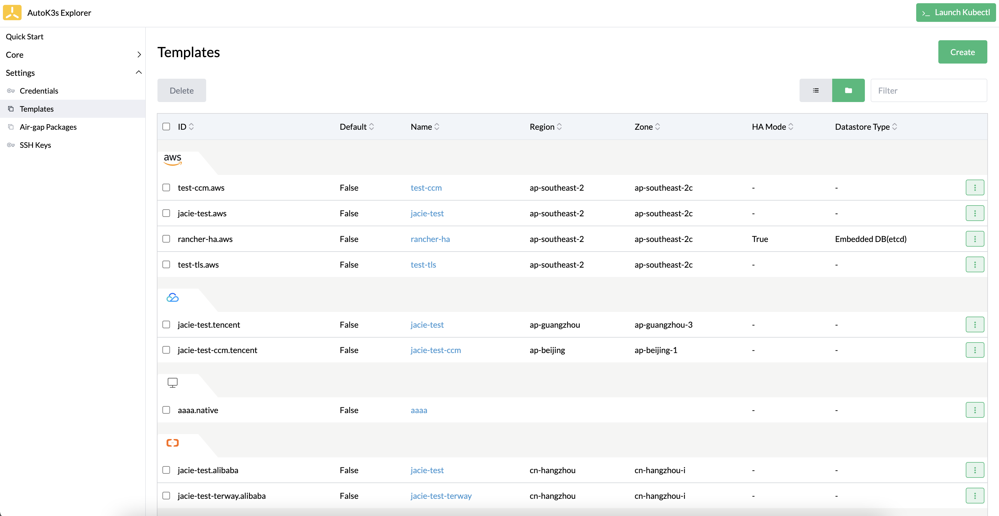
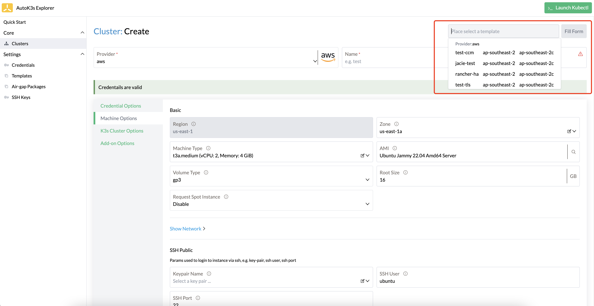
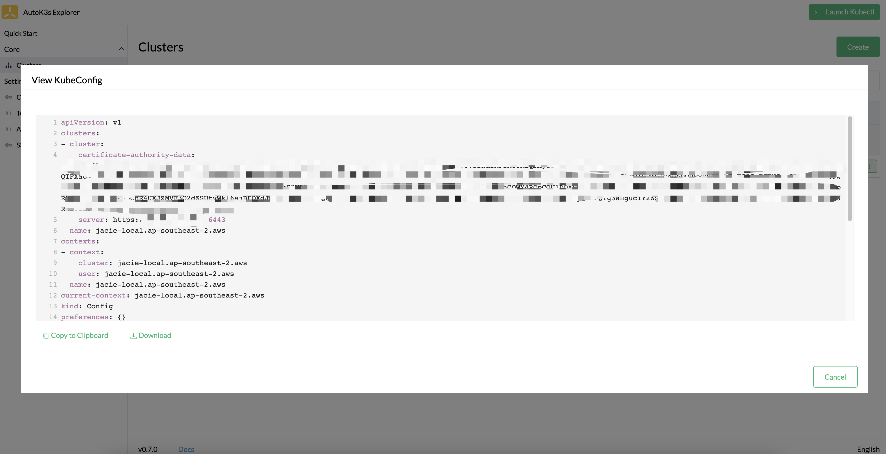
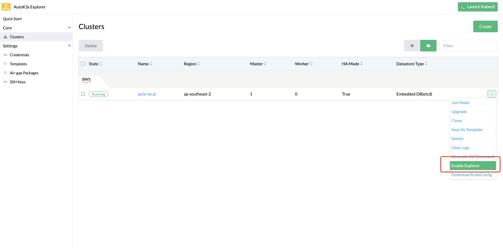
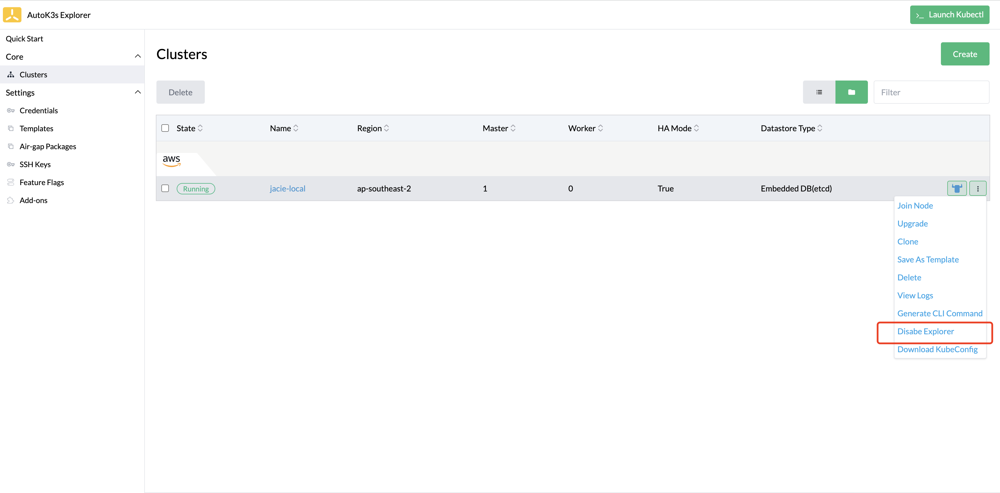

# Native Provider

## 概述

本文介绍了如何在一个能够运行主流操作系统（如 Ubuntu、Debian、Raspbian 等）的虚拟机（VM）中创建和初始化 K3s 集群，以及为已有的 K3s 集群添加节点的操作步骤。除此之外，本文还提供了在 VM 上运行 AutoK3s 的进阶操作指导，如配置私有镜像仓库和启用 UI 组件。

## 前置要求

### 虚拟机要求

提供一个运行主流操作系统（如 **Ubuntu、Debian、Raspbian** 等）的 VM，并为它们注册或设置`SSH密钥/密码`。

### 网络

VM 实例**至少**需要应用以下入站及出站规则：

```bash
Rule        Protocol    Port      Source             Description
InBound     TCP         22        ALL                SSH Connect Port
InBound     TCP         6443      K3s agent nodes    Kubernetes API
InBound     TCP         10250     K3s server & agent Kubelet
InBound     TCP         8999      K3s dashboard      (Optional) Required only for Dashboard UI
InBound     UDP         8472      K3s server & agent (Optional) Required only for Flannel VXLAN
InBound     TCP         2379,2380 K3s server nodes   (Optional) Required only for embedded ETCD
OutBound    ALL         ALL       ALL                Allow All
```

## UI 使用说明

接下来我们将基于 AutoK3s 本地 UI 介绍如何使用 AutoK3s 工具，在任意主机上创建和管理 K3s 集群。如果您想了解 CLI 的使用，请移步到 [CLI 使用说明](#cli-使用说明)

您可以通过[快速体验](../README.md#快速体验)中的描述，通过 Docker 或者 CLI 启动本地 UI，打开浏览器，访问目标端口 `8080` 即可。

### 快速创建集群

您可以使用快速创建功能，在指定的云提供商服务中，快速启动一个K3s集群。

以下图为例，我们将在您准备好的 VM 中使用默认配置创建一个单节点的 K3s 集群。


**表 1：快速创建参数**

| 参数                         | 说明                                                         | 默认值
|:---------------------------|:-----------------------------------------------------------| :-----------------
| Provider                   | 云提供商名称                                                     | `native`
| Name                       | K3s集群名称                                                    |
| Master IPs                 | Master 节点IP                                                |
| Worker IPs                 | Worker 节点IP                                                |
| High Availability Clusters | 启用嵌入式 DB 高可用 K3s（即开启 `--cluster-init` 设置）    | `false`
| SSH User                   | SSH 用户                                                     | `root`
| SSH Key Path               | 如果您选择了已有的密钥对，需要指定SSH 私钥目录，如果您使用AutoK3s 自动生成的密钥，这里可以不填写任何内容 |

### 自定义参数创建

您可以在集群列表页点击 **Create** 按钮进入自定义参数页面进行更多参数的设置。

使用 Native 模式创建 K3s 集群的自定义参数配置分为三项，VM 配置、K3s集群配置、高级选项。接下来对每个配置项进行详细说明。

#### VM 配置

实例配置主要配置的内容为 VM 的连接信息。


**表 3：实例配置参数**

| 参数                  | 说明                                                                                                                                                        | 默认值
|:--------------------|:----------------------------------------------------------------------------------------------------------------------------------------------------------|:------------- 
| Master IPs          | Master 主机 IP 列表                                                                                                                                           |
| Worker IPs          | Worker 主机 IP 列表                                                                                                                                           |
| SSH User            | SSH 用户                                                                                                                                                    | `root`
| SSH Port            | SSH 端口                                                                                                                                                    | `22`
| Private Key Options | Private Key 选项，支持 Local Private Key File Path(选择本地的private key)，Raw Private Key(上传本地的private key保存)，Stored Private Key(在AutoK3s SSH Key管理中保存的private key) | `Local Private Key File Path`
| SSH Key Path        | 如果您选择了已有的密钥对，并且使用 Local Private Key File Path 类型，需要指定SSH 私钥目录                                                                                             |
| Private Key         | 如果您选择了已有的密钥对，并且使用 Raw Private Key 类型，需要将 private key 信息填写到这里                                                                                              |                                                           |
| SSH Key Name        | 如果您选择了已有的密钥对，并且使用 Stored Private Key 类型，则需要选择已保存的 private Key                                                                                             |
| SSH Key Passphrase  | 如果您的私钥需要密码验证，请在这里输入密码                                                                                                                                     |
| SSH Password        | 如果您使用Password连接到虚拟机，请输入密码                                                                                                                                 |
| SSH Agent Auth      | 如果您配置 SSH 代理程序，可以开启此项配置                                                                                                                                   | false
| SSH Cert Path       | 如果您配置了 ssh certificate，在这里您需要将 certificate path 传入进来，以保证 AutoK3s 可以通过ssh连接到远程虚拟机                                                                          |

#### K3s 参数配置

K3s 参数配置项主要对 K3s 集群进行设置，例如是否部署 HA 模式、K3s 安装版本等。


**表 4：K3s 配置参数**

| 参数                           | 说明 | 默认值
|:-----------------------------| :------------------ |:------------- 
| Install With Air-gap Package | 是否使用离线安装包安装 K3s，关于离线包的使用请参考[离线安装](../airgap/README.md)                                                                                                                           |
| Air-gap Package Name         | 离线包名称，仅当选中 Install With Air-gap Package 时设置                                                                                                                                      |
| K3s Channel                  | 用于获取 K3s 下载 URL 的通道。选项包括：`stable`, `latest`, `testing`。 | `stable`
| K3s Version                  | 安装的 K3s 版本，如果设置则覆盖 Channel 选项 |
| K3s Install Script           | K3s 安装脚本                                                                                                                                                                         | `https://rancher-mirror.rancher.cn/k3s/k3s-install.sh`
| System Default Registry      | 用于所有 System Images 的私有镜像仓库                                                                                                                                                       |
| High Availability Clusters   | 启用嵌入式 DB 高可用 K3s（即开启 `--cluster-init` 设置）                                                                                                                                        | false
| Datastore Type               | 数据源类型，支持 `Embedded etcd`(嵌入式etcd)及 `External DB`(外部数据源)                                                                                                                          | `Embedded etcd`
| Datastore Endpoint           | 数据源设置为 `External DB` 需要配置数据源 endpoint                                                                                                                                            |
| Datastore CA File            | 数据源 CA 文件，如果数据源设置了 TLS 需要配置此项                                                                                                                                                    |
| Datastore Cert File          | 数据源 Cert 文件，如果数据源设置了 TLS 需要配置此项                                                                                                                                                  |
| Datastore Key File           | 数据源 Key 文件，如果数据源设置了 TLS 需要配置此项                                                                                                                                                   |
| Master Extra Args            | Master 节点额外参数设置，例如 `--no-deploy traefik` |
| Worker Extra Args            | Worker 节点额外参数设置，例如 `--node-taint key=value:NoExecute` |
| Token                        | 用于将server或agent加入集群的共享secret，如果不设置，会自动生成一个Token |
| Manifests                    | 自动部署应用清单目录，这里支持设置某个manifest文件或者包含多个manifest文件的目录路径（仅支持一层目录），具体功能可查看[这里](http://docs.rancher.cn/docs/k3s/advanced/_index/#%E8%87%AA%E5%8A%A8%E9%83%A8%E7%BD%B2%E6%B8%85%E5%8D%95) |
| TLS Sans                     | 在 TLS 证书中添加其他主机名或 IP 作为主题备用名称，具体功能可查看[这里](https://docs.rancher.cn/docs/k3s/installation/install-options/server-config/_index#%E7%9B%91%E5%90%AC) |
| Registry                     | [私有镜像仓库配置](https://docs.rancher.cn/docs/k3s/installation/private-registry/_index) |

#### 高级选项

配置要开启的 UI 组件（kube-explorer）。


**表 4：高级选项**

| 参数  | 说明 | 默认值
|:----| :------------------- |:------------- 
| UI  | 开启的 UI 组件（kube-explorer） |

### 集群模板

您可以使用模板功能，提前预置好常用的集群模板，每次创建集群时可以用模板参数进行填充，极大精简了重复操作。一次编写，多次运行，提升效率。

创建集群模板的参数与上面描述的自定义参数创建集群的表单内容相同，在这里不做赘述。



您可以选择最常用的模板，点击右侧下拉框中的 **Set Default** 按钮，将模板设置为默认模板。


设置为默认模板后，您可以通过快速创建功能一键部署常用配置的 K3s 集群。


如果您想使用其他模板创建集群，您还可以在快速创建页面的右上角，或者在自定义创建集群的右上角筛选模板，点击 **Fill Form** 按钮后，会自动根据模板内容填充表单。



### 集群管理

您可以在集群列表页查看和管理使用 AutoK3s 创建的 K3s 集群。

#### 添加节点

选中您要添加节点的集群，点击右侧下拉菜单中的 **Join Node** 按钮，在弹出的窗口中设置要添加的节点 IP 及可连接到主机的 SSH 信息即可。


#### 集群升级

选中您要升级的集群，点击右侧下拉菜单中的 **Upgrade** 按钮，在弹出窗口中会显示您当前集群配置的版本信息，例如下图示例中，显示集群版本为 `v1.24.9+k3s2`。


如果您想使用离线包进行升级，可勾选 `Upgrade With Air-gap Package`后，选择已经下载好的离线包即可。


如果我们要将集群升级到 `v1.25.5+k3s2`，则修改 Version 为指定版本号即可；如果想要将集群升级到最新的stable版本，则删除掉 Version 指定的版本号。


选择要升级的版本后，点击 **Upgrade** 按钮，等待集群升级完成。


#### Kubectl

如果您想操作 K3s 集群数据，可以点击右上角 **Launch Kubectl** 按钮，在下拉框中选择要操作的集群后，便可以在 UI 控制台操作选中的集群了。


#### 下载 Kubeconfig 文件

如果您想在其他地方管理集群，可以单独下载指定集群的 Kubeconfig 文件。点击指定集群右侧下拉菜单中的 **Download KubeConfig** 按钮，在弹出窗口中选择复制或下载文件。



#### SSH

如果您想连接到远程主机进行操作，您可以在集群列表页面点击集群名称，进入详情页面，选择要连接的主机，点击右侧 **Execute Shell** 按钮。


#### 开启 kube-explorer dashboard

您可以在创建集群时，通过 Additional Options 选择 explorer 选项开启 kube-explorer 功能。


也可以通过右侧下拉菜单中选择 Enable Explorer 功能来开启 kube-explorer。



开启后，在集群列表会增加 dashboard 跳转链接按钮，点击跳转链接便可以访问 kube-explorer dashboard 页面了。


#### 关闭 kube-explorer dashboard

对于已经开启了 kube-explorer 功能的集群，可以在右侧下拉菜单中选择 Disable Explorer 功能来关闭 kube-explorer 服务。



## CLI 使用说明

更多参数请运行`autok3s <sub-command> --provider native --help`命令。

### 创建普通集群

运行以下命令，在 VM 上创建并启动创建一个名为 “myk3s”的集群，并为该集群配置 1 个 master 节点和 1 个 worker 节点。

```bash
autok3s -d create \
    --provider native \
    --name myk3s \
    --ssh-user <ssh-user> \
    --ssh-key-path <ssh-key-path> \
    --master-ips <master-ip-1,master-ip-2> \
    --worker-ips <worker-ip-1,worker-ip-2>
```

### 创建高可用 K3s 集群

创建高可用集群的命令分为两种，取决于您选择使用的是内置的 etcd 还是外部数据库。

#### 嵌入式 etcd（k3s 版本 >= 1.19.1-k3s1)

运行以下命令，在 VM 上创建并启动创建了一个名为“myk3s”的高可用 K3s 集群。

```bash
autok3s -d create \
    --provider native \
    --name myk3s \
    --ssh-user <ssh-user> \
    --ssh-key-path <ssh-key-path> \
    --master-ips <master-ip-1,master-ip-2,master-ip-3> \
    --cluster
```

#### 外部数据库

在高可用模式下使用外部数据库，需要满足两个条件：

- master 节点的数量不小于 1。
- 需要提供外部数据库的存储路径。

所以在以下的代码示例中，我们通过`--master-ips <master-ip-1,master-ip-2>`指定 master 节点数量为 2，满足 master 节点的数量不小于 1 这个条件；且通过`--datastore "PATH"`指定外部数据库的存储路径，提供外部数据库的存储路径。

运行以下命令，在 VM 上创建并启动创建了一个名为“myk3s”的高可用 K3s 集群：

```bash
autok3s -d create \
    --provider native \
    --name myk3s \
    --ssh-user <ssh-user> \
    --ssh-key-path <ssh-key-path> \
    --master-ips <master-ip-1,master-ip-2> \
    --datastore "mysql://<user>:<password>@tcp(<ip>:<port>)/<db>"
```

### 添加 K3s 节点

请使用`autok3s join`命令为已有集群添加 K3s 节点。

#### 普通集群

运行以下命令，为“myk3s”集群添加 2 个 worker 节点。

```bash
autok3s -d join \
    --provider native \
    --name myk3s \
    --ssh-user <ssh-user> \
    --ssh-key-path <ssh-key-path> \
    --worker-ips <worker-ip-2,worker-ip-3>
```

#### 高可用 K3s 集群

添加 K3s 节点的命令分为两种，取决于您选择使用的是内置的 etcd 还是外部数据库。

##### 嵌入式 etcd

运行以下命令，为高可用集群（嵌入式 etcd: k3s 版本 >= 1.19.1-k3s1）“myk3s”集群添加 2 个 master 节点。

```bash
autok3s -d join \
    --provider native \
    --name myk3s \
    --ssh-user <ssh-user> \
    --ssh-key-path <ssh-key-path> \
    --master-ips <master-ip-2,master-ip-3>
```

##### 外部数据库

运行以下命令，为高可用集群（外部数据库）“myk3s”集群添加 2 个 master 节点。值得注意的是，添加节点时需要指定参数`--datastore`，提供外部数据库的存储路径。

```bash
autok3s -d join \
    --provider native \
    --name myk3s \
    --ssh-user <ssh-user> \
    --ssh-key-path <ssh-key-path> \
    --master-ips <master-ip-2,master-ip-3> \
    --datastore "mysql://<user>:<password>@tcp(<ip>:<port>)/<db>"
```

#### 向已有集群（非AutoK3s管理的集群）添加节点

在 v0.4.9 版本以后，AutoK3s 支持使用 `join` 命令向已有集群中添加节点，在命令执行完成后，可以在 AutoK3s 中对已有的集群进行统一的管理，在使用此功能之前您需要了解以下限制：
- 向已有集群中添加节点时，请保证要添加的主机节点与传入的 master 主机节点使用相同的 ssh 配置，以便 AutoK3s 可以连接到 master 主机节点获取 token 及 kubeconfig 信息。
- 用户执行删除集群操作时，AutoK3s 不会为每个主机执行自动卸载功能。
- 如果想连接到集群已有的主机节点（**不是**通过 `AutoK3s join` 命令添加进来的主机节点），请使用 `autok3s ssh` 命令，UI暂不支持。

运行以下命令，可以将已存在的集群导入到 AutoK3s 中管理，并向该集群中添加 1 个 worker 节点，使用 `--ip` 参数指向已有集群的 master 节点。

```bash
autok3s -d join \
    --provider native \
    --name myk3s \
    --ip <master-ip> \
    --ssh-user <ssh-user> \
    --ssh-key-path <ssh-key-path> \
    --worker-ips <worker-ip>
```

### 删除 K3s 集群

删除一个 k3s 集群，这里删除的集群为 myk3s。

```bash
autok3s -d delete --provider native --name myk3s
```

### 查看集群列表

显示当前主机上管理的所有 K3s 集群列表。

```bash
autok3s list
```

```bash
   NAME     REGION  PROVIDER  STATUS   MASTERS  WORKERS    VERSION     ISHAMODE    DATASTORETYPE
  myk3s             native    Running  1        0        v1.22.6+k3s1  true      Embedded DB(etcd)
```

### 查看集群详细信息

显示具体的 K3s 信息，包括实例状态、主机 ip、集群版本等信息。

```bash
autok3s describe -n <clusterName> -p native
```

> 注意：如果使用不同的 provider 创建的集群名称相同，describe 时会显示多个集群信息，可以使用`-p <provider>`对 provider 进一步过滤。例如：`autok3s describe -n myk3s -p native`。

```bash
Name: myk3s
Provider: native
Region:
Zone:
Master: 1
Worker: 0
IsHAMode: true
DataStoreType: Embedded DB(etcd)
Status: Running
Version: v1.22.6+k3s1
Nodes:
  - internal-ip: [x.x.x.x]
    external-ip: [x.x.x.x]
    instance-status: -
    instance-id: xxxxxxxxxx
    roles: control-plane,master
    status: Ready
    hostname: test
    container-runtime: containerd://1.5.9-k3s1
    version: v1.22.6+k3s1
```

### Kubectl

群创建完成后，`autok3s` 会自动合并 `kubeconfig` 文件。

```bash
autok3s kubectl config use-context myk3s
autok3s kubectl <sub-commands> <flags>
```

在多个集群的场景下，可以通过切换上下文来完成对不同集群的访问。

```bash
autok3s kubectl config get-contexts
autok3s kubectl config use-context <context>
```

### SSH

SSH 连接到集群中的某个主机，这里选择的集群为 myk3s。


```bash
autok3s ssh --provider native --name myk3s
```

如果集群是通过 AutoK3s join 导入管理的，连接到集群其他节点（**不是**通过 `AutoK3s join` 命令添加进来的主机节点），且该节点 ssh 配置与通过 `AutoK3s join` 命令添加进来的主机节点不同时，可以运行如下命令：

```bash
autok3s ssh --provider native --name myk3s <ip> --ssh-user <ssh-user> --ssh-key-path <ssh-key-path>
```

### 升级 K3s 集群

您可以使用以下命令将指定的 K3s 集群升级到 `latest` 版本

```bash
autok3s upgrade --provider native --name myk3s --k3s-channel latest
```

如果您想将 K3s 集群升级到指定版本，可以指定 `--k3s-version`

```bash
autok3s upgrade --provider native --name myk3s --k3s-version v1.22.4+k3s1
```

### 进阶使用

AutoK3s 集成了一些与当前 provider 有关的高级组件，例如私有镜像仓库和 UI。

#### 配置私有镜像仓库

在运行`autok3s create`或`autok3s join`时，通过传递`--registry /etc/autok3s/registries.yaml`参数以使用私有镜像仓库，例如：

```bash
autok3s -d create \
    --provider native \
    --name myk3s \
    --ssh-user <ssh-user> \
    --ssh-key-path <ssh-key-path> \
    --master-ips <master-ip-1,master-ip-2> \
    --worker-ips <worker-ip-1,worker-ip-2> \
    --registry /etc/autok3s/registries.yaml
```

使用私有镜像仓库的配置请参考以下内容，如果您的私有镜像仓库需要 TLS 认证，`autok3s`会从本地读取相关的 TLS 文件并自动上传到远程服务器中完成配置，您只需要完善`registry.yaml`即可。

```bash
mirrors:
  docker.io:
    endpoint:
      - "https://mycustomreg.com:5000"
configs:
  "mycustomreg:5000":
    auth:
      username: xxxxxx # this is the registry username
      password: xxxxxx # this is the registry password
    tls:
      cert_file: # path to the cert file used in the registry
      key_file:  # path to the key file used in the registry
      ca_file:   # path to the ca file used in the registry
```

#### 启用 UI 组件

可以通过 AutoK3s 开启 [kube-explorer](https://github.com/cnrancher/kube-explorer) 对 K3s 集群进行管理。

```bash
autok3s explorer --context <context> --port 9999
```
您可以通过 http://127.0.0.1:9999 访问 kube-explorer dashboard 页面。
