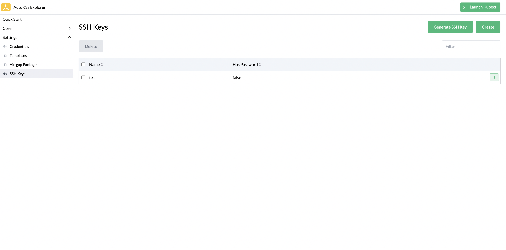
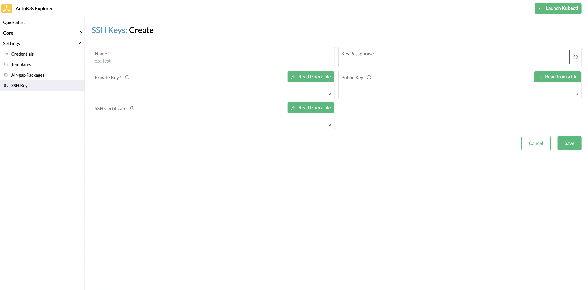
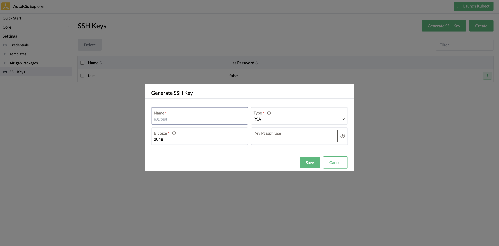
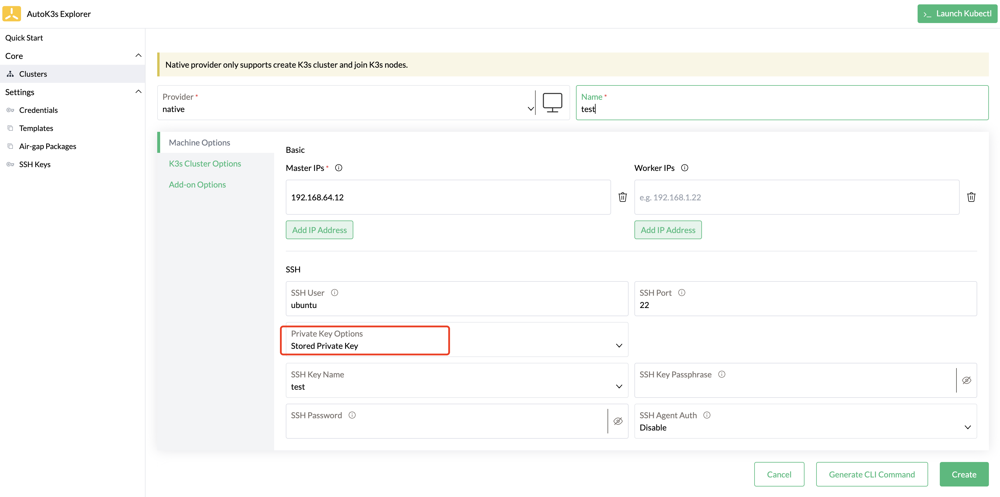

# SSH Key 管理

## 概述

本文介绍 SSH Key 管理功能，AutoK3s 可以通过当前管理的 SSH Key 连接到云服务器来部署 K3s 集群。

## UI 使用说明

接下来我们基于 AutoK3s UI 介绍如何进行 SSH Key 管理功能，并且使用当前管理的 SSH Key 连接云服务器部署 K3s 服务。如果您想了解 CLI 的使用，请移步到 [基础命令](#基础命令)

您可以通过[快速体验](../README.md#快速体验)中的描述，通过 Docker 或者 CLI 启动本地 UI，打开浏览器，访问目标端口 `8080` 即可。

### SSH Key 管理

在左侧菜单选择 `Settings` > `SSH Keys` 进入 SSH Key 管理页面。



如果您想使用已有的 SSH Key，可以通过点击 `Create` 按钮，将其导入到 AutoK3s 中。



**表 1：创建 SSH Key 参数**

| 参数              | 说明                                       | 默认值
|:----------------|:-----------------------------------------| :-----------------
| Name            | SSH Key 名称                               |
| Key Passphrase  | 如果您的私钥需要密码验证，请在这里输入密码                    | 
| Private Key     | SSH 私钥信息                                 |
| Public Key      | SSH 公钥信息                                 |
| SSH Certificate | 如果您配置了 ssh certificate，需要上传 SSH CA 签名的证书 |

您也可以使用 `Generate SSH Key` 自动生成一对新的 SSH 密钥。



**表 2：自动生成 SSH Key 参数**

| 参数             | 说明           | 默认值
|:---------------|:-------------| :-----------------
| Name           | SSH Key 名称   |
| Type           | 密钥类型         | `RSA`
| Bit Size       | 密钥长度(Bit)    | `2048`
| Public Key     | SSH 公钥信息     |
| Key Passphrase | 密钥密码         |

### 使用已有的 SSH Key 创建集群

在创建集群时选择 Stored Private Key，在 SSH Key Name 下拉列表中选择已有的 SSH Key 即可。



## 基础命令

新增 `autok3s sshkey` 子命令用来管理 SSH Keys。以下是 SSH Key 管理的命令行帮助信息：

```sh
Usage:
  autok3s sshkey [command]

Available Commands:
  create      Create a new sshkey pair
  export      export the specificed ssh key pair to files
  list        List all stored ssh key pairs.
  remove      Remove a stored ssh key pair.

Flags:
  -h, --help   help for sshkey

Global Flags:
  -d, --debug   Enable log debug level

Global Environments:
  AUTOK3S_CONFIG  Path to the cfg file to use for CLI requests (default ~/.autok3s)
  AUTOK3S_RETRY   The number of retries waiting for the desired state (default 20)

Use "autok3s sshkey [command] --help" for more information about a command.
```

## 创建/生成新的 SSH key

您可以使用以下导入命令，将已有的 SSH Key 导入到 AutoK3s 中：

```bash
# to import a key pair with the private key ./id_rsa and the public key ./id_rsa.pub
autok3s sshkey create import --key ./id_rsa --public-key ./id_rsa.pub

ssh key import loaded
```

您可以使用以下命令生成一对新的 SSH Key：

```bash
# create a dir to store the generated ssh key
mkdir ./certs
# generate a new ssh key
autok3s sshkey create generated -g -b 2048 -o ./certs

generating RSA ssh key pair with 2048 bit size...
ssh key generated generated
ssh key generated is written to directory ./certs
# see the generated ssh key files
ls -al ./certs

total 16
drwxr-xr-x   4 root  root   128  1 16 14:31 .
drwxr-xr-x  28 root  root   896  1 16 14:15 ..
-rw-------   1 root  root  1679  1 16 14:31 id_rsa
-rw-------   1 root  root   381  1 16 14:31 id_rsa.pub
```

使用以下命令可以查询所有 SSH Key:

```bash
autok3s sshkey list

    NAME     ENCRYPTED
  generated  false
  import     false
```

## 使用保存的 SSH Key 部署 K3s 集群

您可以通过设置 `--ssh-key-name` 参数使用存储的 SSH Key 连接云服务器，部署 K3s 集群。

```bash
autok3s create -p native -n  demo --k3s-version v1.24.9+k3s1 --ssh-key-name import --master-ips 192.168.31.145
```
